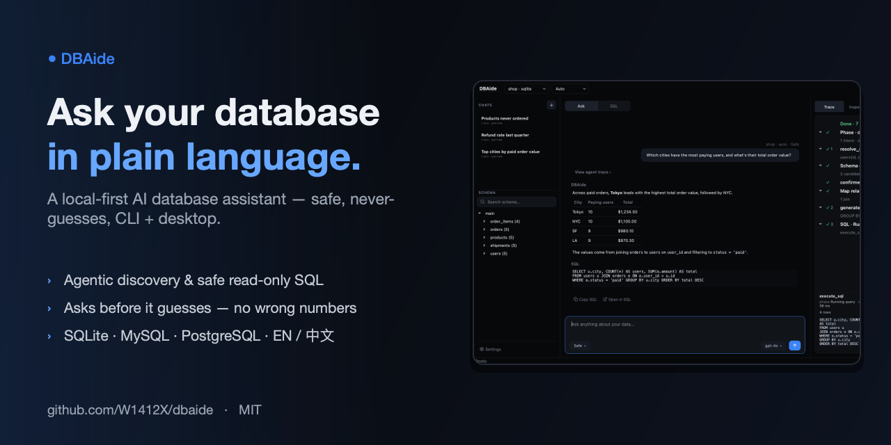
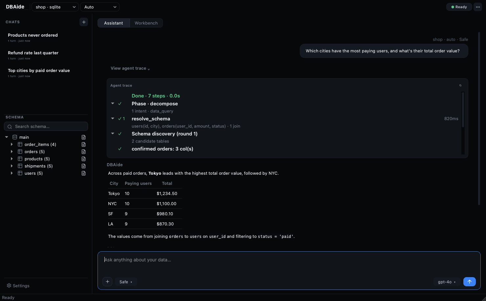
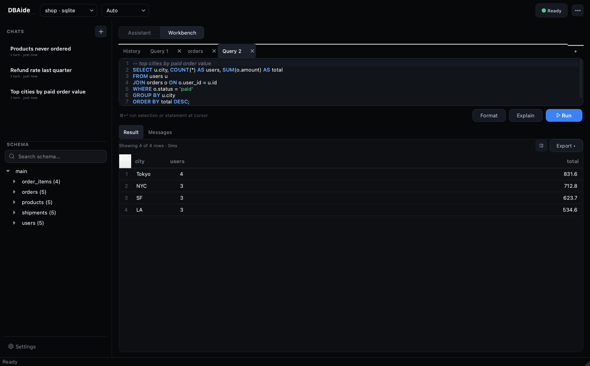
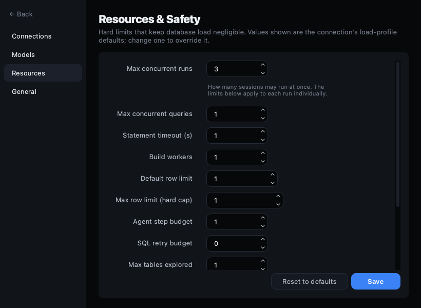

<div align="center">

# DBAide

**A local-first AI database assistant — ask your data in plain language, safely.**

DBAide connects to your databases, discovers schema progressively, refuses to guess
ambiguous business meaning, writes safe read-only SQL, and explains the results — as
a CLI **and** a polished desktop app that share the same Python core.

[](https://www.python.org/)
[](https://pypi.org/project/PyQt6/)
[](#connect-a-database)
[](LICENSE)



</div>

---

## Why DBAide

Most "text-to-SQL" tools happily guess what you meant and hand you a confidently wrong
number. DBAide is built on the opposite principle:

- 🧠 **Agentic, not a one-shot generator.** A tool loop discovers schema, maps joins,
  writes SQL, validates it, runs it, and interprets the result — you watch every step.
- 🙋 **Never guesses.** When the question is ambiguous (which table, what a status value
  means, which timezone, what a metric counts), it **asks you to confirm** instead of
  inventing a default. Your confirmations are remembered for the run.
- 🛡️ **Safe by default.** Read-only, single statement, per-statement timeout, row caps,
  `EXPLAIN` cost gate, and confirmation on risky queries. Every executed SQL is logged.
- 🗂️ **Progressive disclosure.** It narrows instance → database → table → column instead
  of dumping the whole schema into the prompt.
- 💬 **Run many conversations at once.** Each session runs in its own thread; start a
  query in one and switch to another while it works (concurrency is configurable).
- 🧰 **A real database client, too.** Switch to the **Workbench** for a DBeaver-style
  workspace: multiple SQL editors and table viewers, a data browser, structure & DDL,
  query history — all read-only and safe (see below).
- 🔌 **Works offline-ish.** No LLM configured? It falls back to deterministic heuristics
  for inspection, profiling, guardrails and simple queries.

Supports **SQLite, MySQL/MariaDB, and PostgreSQL**, in **English and 简体中文**.

## Screenshots

| Ask — answer · trace · schema | SQL workspace | Resources & safety |
| --- | --- | --- |
|  |  |  |

## Install

Requires **Python 3.11+**.

```bash
# Desktop app + CLI
pip install -e ".[gui]"

# CLI only
pip install -e .
```

SQLite needs no extra drivers; MySQL/PostgreSQL drivers ship with the core install.

## Quickstart

### Desktop

```bash
dbaide-gui
```

Add a connection from **Settings → Connections**, then ask in natural language. The
agent's steps stream into the **Trace** panel on the right; generated SQL can be opened
in the **Workbench** to tweak and re-run.

### Workbench — the database client

Toggle **Assistant / Workbench** at the top. The Workbench is a multi-document
workspace, all read-only and routed through the same guardrails as the agent:

- 📑 **Multiple documents** — open several SQL editors and table viewers at once,
  closeable and re-orderable. `⌘1`/`⌘2` switch modes, `⌘T` opens a new editor, `⌘W`
  closes one.
- ✍️ **SQL editor** — syntax highlighting, schema-aware autocomplete, line numbers,
  current-line highlight, **Format**, **Explain** (query plan), comment toggle (`⌘/`),
  and **run the selection or the statement under the cursor** (`⌘↵`).
- 🔎 **Data browser** — paginated, sortable, filterable (`WHERE …`) grid with a row-
  number gutter, on-demand exact **row count**, an inline value viewer (with JSON
  pretty-printing), and **foreign-key navigation** — right-click a FK cell to open the
  referenced row.
- 🏗️ **Structure** — columns (type/key), foreign-key relations (in/out, clickable),
  indexes, and a generated `CREATE TABLE` you can copy.
- 🕑 **Query history** — every statement you run, recalled per connection; click to
  load, double-click to run.
- ⤵️ **Export** — copy or save results as CSV / JSON / Markdown / `INSERT`.

Right-click a table in the schema tree to open it, or to **Generate SQL**
(`SELECT` / `COUNT` / `INSERT` / `UPDATE` templates).

### CLI

```bash
# Connect (tests the instance and builds offline schema assets by default)
dbaide connect add local --type sqlite --path ./app.db

# Ask in natural language
dbaide ask "Which cities have the most paying users?" --conn local

# Inspect / profile / run SQL
dbaide inspect users --conn local
dbaide profile users --conn local
dbaide sql "select * from users limit 10" --conn local --execute

# Find where something lives, across one or all connections
dbaide find "where is the user email" --conn all
```

## Safe by default

New connections use the conservative **production** load profile. DBAide:

- runs **read-only, single statements** with a per-statement timeout and row caps;
- runs an **`EXPLAIN` cost gate** and asks for confirmation on oversized/low-confidence queries;
- caps **concurrent queries** and drops very large tables to metadata-only profiling;
- **logs every SQL** it runs — inspect with `dbaide queries <conn> --tail 50`.

Relax limits per connection with `--load-profile staging|dev`, or tune every knob in
**Settings → Resources** (desktop) / `[resource_defaults]` in `config.toml`. The per-run
limits are independent of **Max concurrent runs**, which caps how many sessions run at once.

## Configuration

Config lives at `~/.dbaide/config.toml`.

```toml
[models.default]
provider = "openai_compatible"
base_url = "https://api.openai.com/v1"
api_key_env = "OPENAI_API_KEY"
model = "gpt-4.1-mini"
timeout_seconds = 60

[ui]
language = "en"   # or "zh"
```

The agent's answer language follows the UI language so everything stays consistent. If
no model is configured, DBAide uses local heuristics instead of failing.

## Multiple connections

Configured connections are treated as separate database instances and can be queried
together:

```bash
dbaide ask "which instances have order-related tables?" --conn all
dbaide ask "daily order count last 7 days" --conn dev,prod --database dev=shop,prod=shop
```

## Architecture

```text
dbaide/
  cli.py            command-line entry point
  config.py         TOML config (connections, models, resources, language)
  i18n.py           en / zh strings + answer-language policy
  agent/            tool loop, clarifier, SQL writer, controllers, orchestrator
  adapters/         SQLite / MySQL / PostgreSQL
  assets/           offline schema assets (instance → db → table → column)
  rendering/        safe Markdown (mistune) + sanitization
  history/          chat sessions + workflow history
  desktop/          PyQt6 app (views, components, dialogs)
```

The deep design — assets → agent loop → execution, and the safety model — is documented
in **[docs/DESIGN.md](docs/DESIGN.md)**.

## Development

```bash
pip install -e ".[gui,dev]"
pytest -q                       # full suite (GUI tests run headless)
QT_QPA_PLATFORM=offscreen pytest -q tests/   # explicit headless
```

GUI tests render off-screen, so no display is required. See **[CONTRIBUTING.md](CONTRIBUTING.md)**.

## Packaging

Build native bundles (PyInstaller) for macOS, Windows, and Linux:

```bash
./scripts/build_package.sh gui     # desktop bundle  → dist/DBAide/
./scripts/build_package.sh wheel   # Python wheel    → dist/
```

CI does this for all three platforms automatically: pushing a `v*` tag builds the
macOS (`.dmg`, drag-to-Applications), Linux (`.tar.gz`) and Windows (`.msi` installer)
and publishes them to a GitHub Release. Details: **[docs/PACKAGING.md](docs/PACKAGING.md)**.

## Contributing

Issues and pull requests are welcome. Please read **[CONTRIBUTING.md](CONTRIBUTING.md)**
for the dev setup, test conventions, and commit style.

## License

[MIT](LICENSE) © DBAide contributors.
