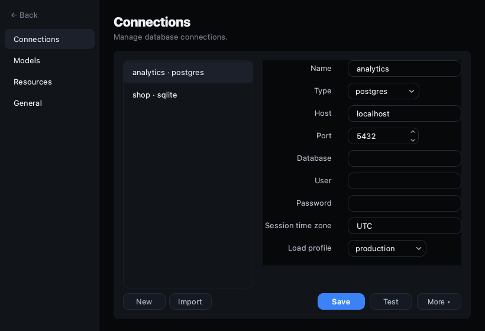

<div align="center">


# DBAide

**A local-first AI database assistant — ask your data in plain language, safely.**

[English](README.md) · [简体中文](README.zh-CN.md)

DBAide connects to your databases, discovers schema progressively, refuses to guess
ambiguous business meaning, writes safe read-only SQL, and explains the results — as
a CLI **and** a polished desktop app that share the same Python core.

[](https://www.python.org/)
[](https://pypi.org/project/PyQt6/)
[](#connect-a-database)
[](LICENSE)


</div>

---

## Install

### Desktop app (recommended)

Download the latest installer for your platform from
**[GitHub Releases](https://github.com/W1412X/dbaide/releases)**:

| Platform | File | What to do |
|----------|------|------------|
| **macOS** (Apple Silicon) | `DBAide-macOS-arm64.dmg` | Open the DMG → drag **DBAide** into **Applications** → see [macOS first launch](#macos-first-launch-allow-the-app) below |
| **Windows** | `DBAide-Windows-x86_64.msi` | Run the installer → launch from the **Desktop** or **Start Menu** shortcut |
| **Linux** | `DBAide-Linux-x86_64.tar.gz` | Extract, then run `./DBAide/DBAide` (see `INSTALL.txt`; **Ubuntu 22.04+**; optional: copy `dbaide.desktop` into `~/.local/share/applications/`) |

No Python required for these builds. Linux tarballs are built on **Ubuntu 22.04 LTS**
(glibc 2.35) and bundle Qt xcb libraries — they run on **22.04 and newer** Ubuntu/Debian
desktops, but not on 20.04 or older. If startup still fails:

```bash
sudo apt install -y libxcb-cursor0 libxkbcommon-x11-0 libgl1 libegl1
```

#### macOS first launch: allow the app

DBAide is **ad-hoc signed** (not Apple-notarized). On first open, macOS may block it or
show no window until you explicitly allow it:

1. Install: open the `.dmg` and drag **DBAide** into **Applications**.
2. Try to open **DBAide** once (double-click in Applications).
3. If macOS says the app **cannot be opened** because the developer cannot be verified:
   - Open **System Settings → Privacy & Security**.
   - Scroll down — you should see **"DBAide" was blocked from use** (or similar).
   - Click **Open Anyway**, then confirm **Open**.
   - **Or:** **right-click** (Control-click) **DBAide → Open**, click **Open** in the
     dialog (this bypass is only needed the **first** time).
4. Launch **DBAide** again normally.

> **Tip:** To verify the app is running, you can also start it from Terminal:
> `/Applications/DBAide.app/Contents/MacOS/DBAide` — a healthy launch keeps the
> process running and shows the window.

Use a recent release (**v0.0.8+**); older desktop builds had a startup bug that exited
immediately with no error dialog.

### From source (CLI + desktop)

Requires **Python 3.11+**.

```bash
git clone https://github.com/W1412X/dbaide.git
cd dbaide

# Desktop app + CLI
pip install -e ".[gui]"

# CLI only
pip install -e .
```

SQLite needs no extra drivers; MySQL/PostgreSQL drivers ship with the core install.

**Ubuntu / Debian (desktop from source):** install Qt xcb libraries once (22.04+;
enable `universe` if `libxcb-cursor0` is missing):

```bash
sudo apt install -y libxcb-cursor0 libxkbcommon-x11-0 libgl1 libegl1
```

Then run `dbaide-gui` (desktop) or `dbaide` (CLI).

---

## Why DBAide

Most "text-to-SQL" tools happily guess what you meant and hand you a confidently wrong
number. DBAide is built on the opposite principle:

- 🧠 **Agentic, not a one-shot generator.** A tool loop discovers schema, maps joins,
  writes SQL, validates it, runs it, and interprets the result — you watch every step.
  The answer **streams in token-by-token** as the model writes it.
- 🙋 **Never guesses.** When the question is ambiguous (which table, what a status value
  means, which timezone, what a metric counts), it **asks you to confirm** instead of
  inventing a default. Your confirmations carry forward across the session.
- 🛡️ **Safe by default.** Read-only, single statement, per-statement timeout, row caps,
  `EXPLAIN` cost gate, and confirmation on risky queries. Every executed SQL is logged.
- 🗂️ **Progressive disclosure.** It narrows instance → database → table → column instead
  of dumping the whole schema into the prompt.
- 📌 **Pin context.** Use the composer's **+** button to attach specific databases or
  tables as schema context — discovery prioritises what you pin.
- 💬 **Run many conversations at once.** Each session runs in its own thread; start a
  query in one and switch to another while it works (concurrency is configurable).
- 🧰 **A real database client, too.** Switch to the **Workbench** for a DBeaver-style
  workspace: multiple SQL editors and table viewers, a data browser, structure & DDL,
  query history — all read-only and safe (see below).
- 🔌 **Works offline-ish.** No LLM configured? It falls back to deterministic heuristics
  for inspection, profiling, guardrails and simple queries.

Supports **SQLite, MySQL/MariaDB, and PostgreSQL**, in **English and 简体中文**, with
**dark and light themes**.

## Screenshots

| Ask — answer · trace · schema | SQL workspace |
| --- | --- |
|  |  |

| Connections · import/export | Resources & safety |
| --- | --- |
|  |  |

## Quickstart

### Desktop

After [installing](#install) the release build, open **DBAide** from Applications /
Start Menu, or from source:

```bash
dbaide-gui
```

Add a connection from **Settings → Connections**, then ask in natural language. The
final answer **streams in token-by-token**, and every turn carries the agent's steps
inline — click **View agent trace** under a turn to expand the discovery, SQL, and
execution it ran. Generated SQL can be opened in the **Workbench** to tweak and re-run.

Use the **+** button in the composer to pin databases or tables as context for the next
question. Clarifications you confirm carry forward to future questions in the same
session, so the agent learns your intent as you go.

### Workbench — the database client

Toggle **Assistant / Workbench** at the top. The Workbench is a multi-document
workspace, all read-only and routed through the same guardrails as the agent:

- 📑 **Multiple documents** — open several SQL editors and table viewers at once,
  closeable and re-orderable. `⌘1`/`⌘2` switch modes, `⌘T` opens a new editor, `⌘W`
  closes one.
- ✍️ **SQL editor** — syntax highlighting, schema-aware autocomplete, line numbers,
  current-line highlight, **Format**, **Explain** (query plan), comment toggle (`⌘/`),
  and **run the selection or the statement under the cursor** (`⌘↵`).
- 🔎 **Data browser** — paginated, sortable, filterable (`WHERE …`) grid with a row-
  number gutter, on-demand exact **row count**, an inline value viewer (with JSON
  pretty-printing), and **foreign-key navigation** — right-click a FK cell to open the
  referenced row.
- 🏗️ **Structure** — columns (type/key), foreign-key relations (in/out, clickable),
  indexes, and a generated `CREATE TABLE` you can copy.
- 🕑 **Query history** — every statement you run, recalled per connection; click to
  load, double-click to run.
- ⤵️ **Export** — copy or save results as CSV / JSON / Markdown / `INSERT`.

Right-click a table in the schema tree to open it, or to **Generate SQL**
(`SELECT` / `COUNT` / `INSERT` / `UPDATE` templates).

### Import / Export connections

**Settings → Connections → More → Export** saves a single connection (including
joins, annotations, and credentials) as a JSON file. **Export All** saves every
connection and model. **Import** reads either format and merges into the current
config — existing connections are overwritten if confirmed, joins and annotations
are merged.

### CLI

```bash
# Connect (tests the instance and builds offline schema assets by default)
dbaide connect add local --type sqlite --path ./app.db

# Ask in natural language
dbaide ask "Which cities have the most paying users?" --conn local

# Interactive multi-turn chat
dbaide chat --conn local

# Inspect / profile / run SQL
dbaide inspect users --conn local
dbaide profile users --conn local
dbaide sql "select * from users limit 10" --conn local --execute

# Find where something lives, across one or all connections
dbaide find "where is the user email" --conn all

# Schema documentation and diffs
dbaide doc --conn local                     # export schema markdown
dbaide tree --conn local                    # print schema tree
dbaide diff --conn local --conn2 staging    # diff two schemas
dbaide relations --conn local               # show FK and join hints

# Annotate schema with business notes
dbaide annotate add --conn local --table orders --note "orders.status: 1=pending, 2=paid"
dbaide annotate list --conn local

# Offline assets
dbaide assets build local --database mydb   # build for a specific database
dbaide assets status local                  # show asset status
dbaide assets show local orders             # show a specific table asset

# SQL audit log
dbaide queries local --tail 50
```

## Safe by default

New connections use the conservative **production** load profile. DBAide:

- runs **read-only, single statements** with a per-statement timeout and row caps;
- runs an **`EXPLAIN` cost gate** and asks for confirmation on oversized/low-confidence queries;
- caps **concurrent queries** and drops very large tables to metadata-only profiling;
- **logs every SQL** it runs — inspect with `dbaide queries <conn> --tail 50`.

Relax limits per connection with `--load-profile staging|dev`, or tune every knob in
**Settings → Resources** (desktop) / `[resource_defaults]` in `config.toml`. The per-run
limits are independent of **Max concurrent runs**, which caps how many sessions run at once.

## Configuration

Config lives at `~/.dbaide/config.toml`.

```toml
[models.default]
provider = "openai_compatible"
base_url = "https://api.openai.com/v1"
api_key_env = "OPENAI_API_KEY"
model = "gpt-4.1-mini"
timeout_seconds = 60

[ui]
language = "en"   # or "zh"
theme = "dark"    # or "light"

[resource_defaults]
# Override per-knob limits; see docs/DESIGN.md for all knobs
# statement_timeout_seconds = 8
# default_row_limit = 100
```

The agent's answer language follows the UI language so everything stays consistent. If
no model is configured, DBAide uses local heuristics instead of failing.

Environment overrides:

- `DBAIDE_CONFIG` — alternate config file path
- `DBAIDE_LOG_DIR` — log directory (default `~/.dbaide/logs`)
- `DBAIDE_LOG_LEVEL` — `DEBUG`, `INFO`, `WARNING`, `ERROR`

## Multiple connections

Configured connections are treated as separate database instances and can be queried
together:

```bash
dbaide ask "which instances have order-related tables?" --conn all
dbaide ask "daily order count last 7 days" --conn dev,prod --database dev=shop,prod=shop
```

## Architecture

```text
dbaide/
  cli.py              command-line entry point
  gui.py              desktop app entry point
  config.py           TOML config (connections, models, resources, language)
  i18n.py             en / zh strings + answer-language policy
  llm.py              LLM client (OpenAI-compatible API, streaming support)
  models.py           query result / column / profile data models
  agent/              tool loop, clarifier, SQL writer, controllers, orchestrator
    loop.py           AskAgentLoop — the single tool-calling loop
    orchestrator.py   AskOrchestrator — sets up and runs the loop
    run_state.py      per-run state (schemas, relations, SQL, memory)
    toolkit/          tool implementations (schema, SQL, profile, catalog, memory)
  adapters/           SQLite / MySQL / PostgreSQL
  assets/             offline schema assets (instance → db → table → column)
  core/               result types, events, errors
  db/                 connection pool, resource policy, query budget
  validation/         deterministic SQL guards (SchemaGuard, CTE parser)
  rendering/          safe Markdown (mistune) + sanitization
  annotations/        schema annotations (business notes)
  joins/              join catalog (user-saved + agent-discovered edges)
  history/            chat sessions, query history, debug bundles
  desktop/            PyQt6 app
    views/            main window, sidebar, topbar, workbench, ask tab, SQL tab
    components/       composer, conversation, session list, table, trace, editor
    dialogs/          settings, connection, joins, build assets, note editor
```

The deep design — assets → agent loop → execution, and the safety model — is documented
in **[docs/DESIGN.md](docs/DESIGN.md)**.

## Data layout

All local state lives under `~/.dbaide/`:

| Path | Purpose |
|------|---------|
| `config.toml` | Connections, models, UI language/theme, resource limits |
| `assets/instances/{conn}/` | Offline schema documents |
| `joins/instances/{conn}/` | User-saved and agent-discovered join catalog |
| `annotations/{conn}/` | Schema annotations (business notes on tables/columns) |
| `logs/dbaide.log` | Rotating application log |
| `logs/queries/{conn}.jsonl` | SQL audit log (every executed statement) |
| `query_history/{conn}.jsonl` | Workbench SQL editor history |
| `sessions/{conn}/` | Chat session memory (per-turn Q/A/trace) |
| `debug/` | Exported debug bundles (ZIP) for support |

## Development

```bash
pip install -e ".[gui,dev]"
pytest -q                       # full suite (GUI tests run headless)
QT_QPA_PLATFORM=offscreen pytest -q tests/   # explicit headless
```

GUI tests render off-screen, so no display is required. See **[CONTRIBUTING.md](CONTRIBUTING.md)**.

## Packaging

Build native bundles (PyInstaller) for macOS, Windows, and Linux:

```bash
./scripts/build_package.sh gui     # desktop bundle  → dist/DBAide/
./scripts/build_package.sh wheel   # Python wheel    → dist/
```

CI does this for all three platforms automatically: pushing a `v*` tag builds the
macOS (`.dmg`, drag-to-Applications), Linux (`.tar.gz`) and Windows (`.msi` installer)
and publishes them to a GitHub Release. Details: **[docs/PACKAGING.md](docs/PACKAGING.md)**.

## Contributing

Issues and pull requests are welcome. Please read **[CONTRIBUTING.md](CONTRIBUTING.md)**
for the dev setup, test conventions, and commit style.

## License

[MIT](LICENSE) © DBAide contributors.
