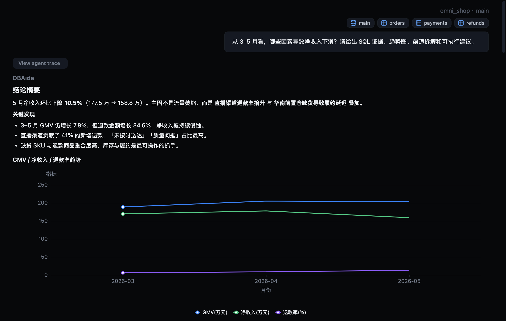
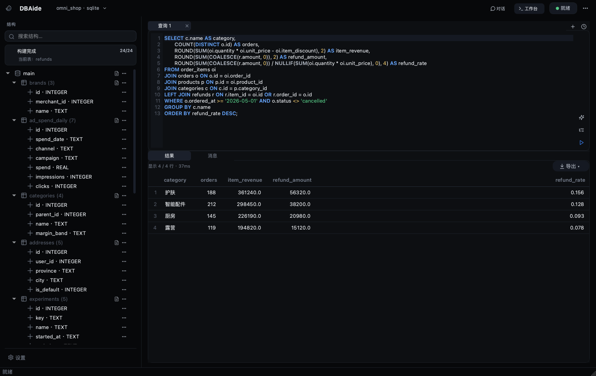
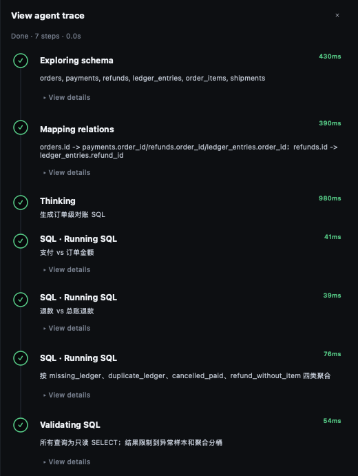
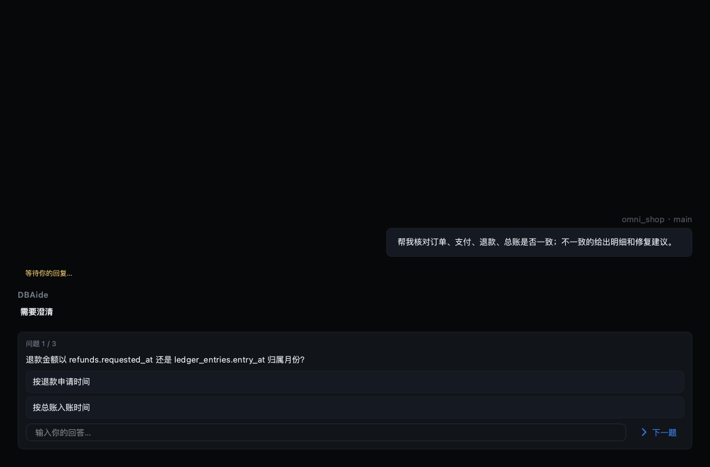
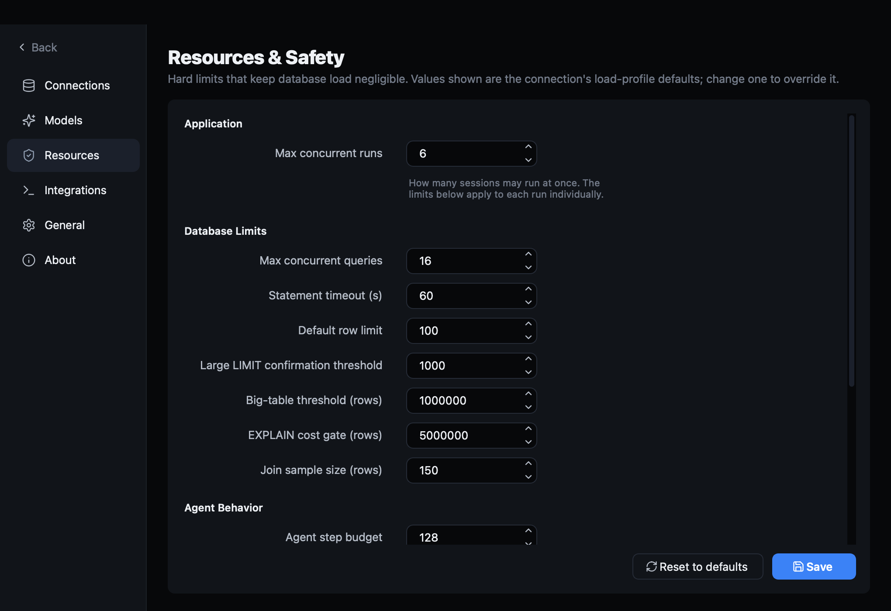
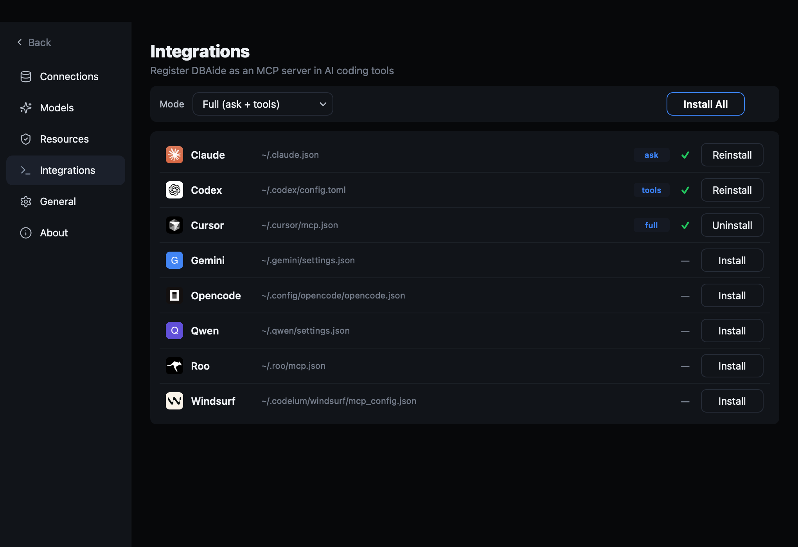

<div align="center">


# DBAide

**本地优先的 AI 数据库助手 — 用自然语言安全地提问你的数据。**

[English](README.md) · **简体中文**

DBAide 连接你的数据库，渐进式发现 schema，拒绝臆测含糊的业务含义，生成安全的只读 SQL，
并解释查询结果 — 提供 **CLI** 与 **桌面应用**，共享同一套 Python 核心。

[](https://www.python.org/)
[](https://pypi.org/project/PyQt6/)
[](#连接数据库)
[](LICENSE)


### 演示


*能力速览 —— 资产初始化、运行时 trace、图表化回答、SQL 工作台与设置。高清版本：[MP4](docs/images/demo.mp4)。*

</div>

---

## 安装

### 桌面应用（推荐）

从 **[GitHub Releases](https://github.com/W1412X/dbaide/releases)** 下载对应平台的安装包：

| 平台 | 文件 | 安装方式 |
|------|------|----------|
| **macOS**（Apple Silicon） | `DBAide-macOS-arm64.dmg` | 打开 DMG → 将 **DBAide** 拖入 **应用程序** → 见下方 [macOS 首次打开](#macos-首次打开允许运行) |
| **Windows** | `DBAide-Windows-x86_64.msi` | 运行安装程序 → 从 **桌面** 或 **开始菜单** 快捷方式启动 |
| **Linux** | `DBAide-Linux-x86_64.tar.gz` | 解压后运行 `./DBAide/DBAide`（见 `INSTALL.txt`；**Ubuntu 22.04+**；可选：将 `dbaide.desktop` 复制到 `~/.local/share/applications/`） |

安装包无需 Python。Linux 包在 **Ubuntu 22.04 LTS**（glibc 2.35）上构建并内置 Qt xcb
依赖，适用于 **22.04 及更新**的 Ubuntu/Debian 桌面，不支持 20.04 及更早版本。若仍无法启动：

```bash
sudo apt install -y libxcb-cursor0 libxkbcommon-x11-0 libgl1 libegl1
```

以上安装包**无需安装 Python**。

#### macOS 首次打开：允许运行

DBAide 使用 **ad-hoc 签名**（未经过 Apple 公证）。首次打开时，macOS 可能拦截应用，
或看起来「点了没反应」：

1. **安装**：打开 `.dmg`，将 **DBAide** 拖入 **应用程序（Applications）**。
2. **尝试打开一次**：在「应用程序」中双击 **DBAide**。
3. 若提示 **无法打开**、**无法验证开发者** 或类似信息：
   - 打开 **系统设置 → 隐私与安全性**（旧版 macOS 为「系统偏好设置 → 安全性与隐私」）。
   - 向下滚动，应能看到 **「已阻止使用 DBAide」**（或类似文案）。
   - 点击 **仍要打开**，并在弹窗中确认 **打开**。
   - **或者**：**按住 Control 键点击**（或右键）**DBAide → 打开**，在对话框中点 **打开**（**仅首次**需要此操作）。
4. 再次正常启动 **DBAide**。

> **提示**：也可在终端验证是否正常启动：
> `/Applications/DBAide.app/Contents/MacOS/DBAide`
> — 正常时进程会持续运行并弹出窗口。

请使用较新版本（**v0.0.8 及以上**）；更早的桌面版存在启动后立即退出的 bug，且不会显示错误对话框。

### 从源码安装（CLI + 桌面）

需要 **Python 3.11+**。

```bash
git clone https://github.com/W1412X/dbaide.git
cd dbaide

# 桌面应用 + CLI
pip install -e ".[gui]"

# 仅 CLI
pip install -e .
```

SQLite 无需额外驱动；MySQL / PostgreSQL 驱动已包含在核心依赖中。

**Ubuntu / Debian（源码运行桌面）：** 先安装 Qt xcb 系统库（22.04+；若找不到
`libxcb-cursor0` 需先 `sudo add-apt-repository universe`）：

```bash
sudo apt install -y libxcb-cursor0 libxkbcommon-x11-0 libgl1 libegl1
```

然后运行 `dbaide-gui`（桌面）或 `dbaide`（CLI）。

---

## 为什么选择 DBAide

许多「文本转 SQL」工具会随意猜测你的意图，然后给出一个看似自信却错误的数字。DBAide 的原则相反：

- 🧠 **Agent 式，而非一次性生成。** 工具循环依次发现 schema、映射 join、编写 SQL、
  校验、执行并解读结果 — 每一步都可查看。回答会**逐 token 流式**输出。
- 🙋 **绝不瞎猜。** 问题含糊时（哪张表、状态码含义、时区、指标口径等），会**请你确认**
  而不是默认假设；确认结果在同一会话中持续生效。
- 🛡️ **默认安全。** 只读、单语句、超时、行数上限、`EXPLAIN` 成本闸、高风险查询确认；
  每条执行的 SQL 均有日志。
- 🗂️ **渐进式披露。** 按 实例 → 库 → 表 → 列 逐步收窄，而非把整个 schema 塞进 prompt。
- 📌 **固定上下文。** 在输入框用 **+** 附加库/表，发现过程优先使用你固定的对象。
- 💬 **多会话并发。** 各会话独立运行，可在一个会话提问后切换到另一个（并发数可配置）。
- 📊 **回答内图表 + HTML 导出。** Markdown 与 ECharts 统一渲染；**更多 → 导出 HTML…**
  可设边距并预览；需缩放时用 **图表交互…** 独立窗口，不影响对话滚动。
- 🧰 **也是正经数据库客户端。** 切换到 **工作台（Workbench）**，多文档 SQL 编辑器、
  表浏览器、结构/DDL、查询历史 — 只读且走同一套护栏。
- 🔌 **弱网/无模型也能用。** 未配置 LLM 时，检查、 profiling、护栏与简单查询仍可用本地启发式逻辑。

支持 **SQLite、MySQL/MariaDB、PostgreSQL**，界面与回答支持 **English / 简体中文**，
**深色 / 浅色**主题。

## 延伸阅读

- [截图导览（中文）](docs/SHOWCASE.zh-CN.md)
- [截图导览（English）](docs/SHOWCASE.md)
- [架构设计](docs/DESIGN.md)
- [宣传博文](docs/BLOG.zh-CN.md)

## 截图

| 图表渲染 | SQL 工作台 |
| --- | --- |
|  |  |

| Agent Trace | 澄清问题 |
| --- | --- |
|  |  |

| 资源与安全 | MCP 集成 |
| --- | --- |
|  |  |

## 快速开始

### 桌面应用

按上方 [安装](#安装) 说明安装 Release 包后，从「应用程序」/ 开始菜单打开 **DBAide**；
若从源码安装，运行：

```bash
dbaide-gui
```

在 **设置 → 连接** 中添加数据库，然后用自然语言提问。最终回答**流式输出**；
每轮对话下方可展开 **查看 Agent 轨迹**。生成的 SQL 可送到 **工作台** 编辑并重跑。

输入框 **+** 可固定库/表作为上下文；你确认的澄清会在同一会话后续问题中继续生效。

### 工作台 — 数据库客户端

顶栏切换 **对话 / 工作台**。工作台为多文档只读工作区：

- 📑 **多文档** — 多个 SQL 编辑器与表视图，可关闭、排序。`⌘1`/`⌘2` 切换模式，
  `⌘T` 新建编辑器，`⌘W` 关闭当前文档。
- ✍️ **SQL 编辑器** — 高亮、schema 补全、行号、**格式化**、**Explain**、注释切换（`⌘/`）、
  **运行选区或光标下语句**（`⌘↵`）。
- 🔎 **数据浏览** — 分页、排序、`WHERE` 筛选、行号列、精确 **行数统计**、JSON 美化查看、
  **外键跳转**（右键 FK 单元格）。
- 🏗️ **结构** — 列/键、外键关系、索引、可复制的 `CREATE TABLE`。
- 🕑 **查询历史** — 按连接记录；单击载入，双击执行。
- ⤵️ **导出** — CSV / JSON / Markdown / `INSERT`。

在左侧 schema 树右键表可打开数据，或 **生成 SQL** 模板。

### 连接导入 / 导出

**设置 → 连接 → 更多 → 导出** 可导出单个连接（含 join、注释、凭据）为 JSON。
**全部导出** 包含所有连接与模型配置。**导入** 合并到当前配置。

### CLI

```bash
# 添加连接（默认会测试并构建离线 schema 资产）
dbaide connect add local --type sqlite --path ./app.db

# 自然语言提问
dbaide ask "哪些城市的付费用户最多？" --conn local

# 多轮交互
dbaide chat --conn local

# 检查 /  profiling / 执行 SQL
dbaide inspect users --conn local
dbaide profile users --conn local
dbaide sql "select * from users limit 10" --conn local --execute

# 跨连接搜索
dbaide find "用户邮箱在哪个表" --conn all

# Schema 文档与 diff
dbaide doc --conn local
dbaide tree --conn local
dbaide diff --conn local --conn2 staging
dbaide relations --conn local

# 业务注释
dbaide annotate add --conn local --table orders --note "orders.status: 1=待支付, 2=已支付"
dbaide annotate list --conn local

# 离线资产
dbaide assets build local --database mydb
dbaide assets status local
dbaide assets show local orders

# SQL 审计日志
dbaide queries local --tail 50
```

## 默认安全

新连接使用保守的 **production** 负载配置：

- **只读单语句**，带超时与行数上限；
- **`EXPLAIN` 成本闸**，过大/低置信度查询需确认；
- **并发查询上限**，超大表仅 metadata profiling；
- **记录每条 SQL** — `dbaide queries <conn> --tail 50` 查看。

可用 `--load-profile staging|dev` 放宽单连接限制，或在桌面 **设置 → 资源** /
`config.toml` 的 `[resource_defaults]` 中细调。**最大并发运行数** 控制同时进行的会话数，
与单条 SQL 的资源限制相互独立。

## 配置

配置文件：`~/.dbaide/config.toml`

```toml
[models.default]
provider = "openai_compatible"
base_url = "https://api.openai.com/v1"
api_key_env = "OPENAI_API_KEY"
model = "gpt-4.1-mini"
timeout_seconds = 60

[ui]
language = "zh"   # 或 "en"
theme = "dark"    # 或 "light"

[resource_defaults]
# 覆盖各项限制，完整说明见 docs/DESIGN.md
# statement_timeout_seconds = 8
# default_row_limit = 100
```

Agent 回答语言跟随 UI 语言。未配置模型时，使用本地启发式逻辑而非直接失败。

环境变量：

- `DBAIDE_CONFIG` — 配置文件路径
- `DBAIDE_LOG_DIR` — 日志目录（默认 `~/.dbaide/logs`）
- `DBAIDE_LOG_LEVEL` — `DEBUG`、`INFO`、`WARNING`、`ERROR`

## 多连接

已配置的连接视为独立实例，可组合查询：

```bash
dbaide ask "哪些实例有订单相关的表？" --conn all
dbaide ask "近 7 日订单量" --conn dev,prod --database dev=shop,prod=shop
```

## 架构

```text
dbaide/
  cli.py              CLI 入口
  gui.py              桌面应用入口
  config.py           TOML 配置（连接、模型、资源、语言）
  i18n.py             中英文文案与回答语言策略
  llm.py              LLM 客户端（OpenAI 兼容 API、流式）
  agent/              工具循环、澄清、SQL 编写、编排
  adapters/           SQLite / MySQL / PostgreSQL
  assets/             离线 schema 资产
  desktop/            PyQt6 桌面 UI
  ...
```

详细设计见 **[docs/DESIGN.md](docs/DESIGN.md)**（英文）。

## 本地数据目录

所有状态位于 `~/.dbaide/`：

| 路径 | 用途 |
|------|------|
| `config.toml` | 连接、模型、语言/主题、资源限制 |
| `assets/instances/{conn}/` | 离线 schema 文档 |
| `joins/instances/{conn}/` | Join 目录 |
| `annotations/{conn}/` | 表/列业务注释 |
| `logs/dbaide.log` | 应用日志（滚动） |
| `logs/queries/{conn}.jsonl` | SQL 审计日志 |
| `query_history/{conn}.jsonl` | 工作台 SQL 历史 |
| `sessions/{conn}/` | 对话会话 |
| `debug/` | 调试包导出（ZIP） |

## 开发

```bash
pip install -e ".[gui,dev]"
pytest -q
QT_QPA_PLATFORM=offscreen pytest -q tests/
```

详见 **[CONTRIBUTING.md](CONTRIBUTING.md)**。

## 打包发布

```bash
./scripts/build_package.sh gui     # 桌面包 → dist/DBAide/
./scripts/build_package.sh wheel   # Python wheel
```

推送 `v*` 标签后 CI 会自动构建 macOS（`.dmg`）、Linux（`.tar.gz`）、Windows（`.msi`）
并发布到 GitHub Releases。详见 **[docs/PACKAGING.md](docs/PACKAGING.md)**。

## 贡献

欢迎 Issue 与 Pull Request。请先阅读 **[CONTRIBUTING.md](CONTRIBUTING.md)**。

## 许可证

[MIT](LICENSE) © DBAide contributors.
