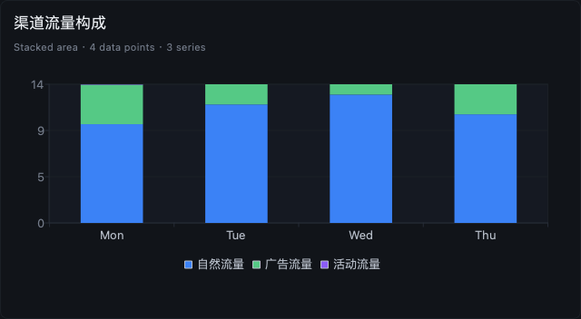
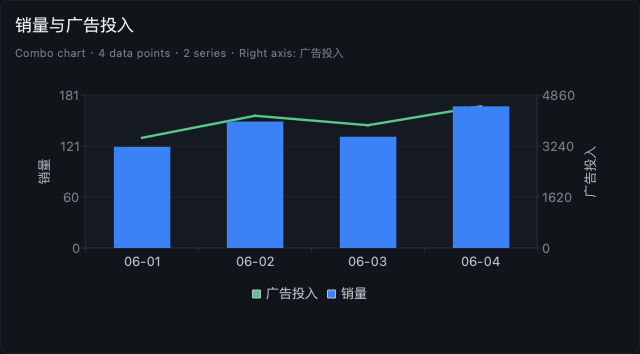
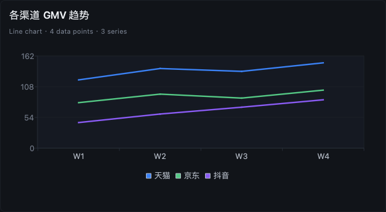

# DBAide：把 AI 数据分析助手，做成真正能上手的数据库工作台

很多所谓的“Text-to-SQL”产品，演示时很好看：一句自然语言，几秒钟吐出一条 SQL，
再配一个看起来像结论的答案。

真正落到生产环境，它们常常会暴露三个问题：

1. **喜欢猜。** 口径不清时不追问，直接默认一种业务含义。
2. **不透明。** 你看不到它到底查了哪些表、为什么这样 join、为什么这条 SQL 过得去。
3. **不适合开发场景。** 它能给“业务问题”写一条 SQL，却很难继续做字段探索、对账、异常归因、结构核查。

DBAide 想解决的不是“把 SQL 写出来”这么窄的问题，而是把整个过程做成一个
**本地优先、默认安全、同时适合业务分析与开发排障的 AI 数据库工作台**。

---

## 不是一次性生成，而是完整的 Agent 工作流

先看一个最典型的业务问题：

> 从 3 月到 5 月，哪些因素导致净收入下滑？请给出 SQL 证据、趋势图、渠道拆解和可执行建议。

DBAide 的处理方式不是直接“猜一条 SQL”，而是先逐步建立证据：

- 发现候选表
- 读取结构和 join 证据
- 生成只读 SQL
- 做风险检查
- 执行结果
- 解释结果并渲染图表

如果你想看图表本身的渲染效果，项目里也保留了实际渲染验证图：

| 堆叠面积图 | 双轴组合图 | 多序列折线图 |
| --- | --- | --- |
|  |  |  |

这里有个关键设计：**模型不会直接写 ECharts option 代码。**

图表能力由独立 chart agent 负责“图表意图和字段映射”，输出结构化 chart spec，
再由本地 renderer 统一转成 ECharts。这样可以避免模型前端代码写错后图表直接渲染失败。

---

## 模糊口径时，不猜，先问

真实业务问题里，最危险的不是 SQL 语法错误，而是**口径错了但你没发现**。

例如：

- 退款金额按申请时间还是按总账入账时间归属？
- 取消订单算不算进支付一致性校验？
- 差异阈值是 0.01 元还是 10 元？

DBAide 在这种地方不会替你拍板，而是主动停下来澄清：

这一点听起来保守，但它直接决定了结果能不能用。

---

## 它也适合开发排障，而不只是“给老板看图”

很多数据助手只能回答“最近 GMV 怎么样”，一旦问题变成：

> `refund_amount` 这个字段到底在哪？  
> 为什么退款表和总账对不上？  
> 哪些订单出现了支付成功但状态取消？

它们就很难继续往下做。

DBAide 把开发排障当成一等场景来设计。

### 1. 字段探索

如果你输入了一个不存在的字段，DBAide 不会硬写 SQL，而是先探索真实结构，
确认字段候选和关联路径，再自动改写成可执行查询。

### 2. 一致性校验

它还能继续往前走，把 orders、payments、refunds、ledger_entries 统一到同一粒度做对账，
再把异常分成可行动的桶。

这就意味着它不是“帮你写一条查询”，而是能帮你推进一整个排障流程。

---

## 它是 AI 助手，也是数据库客户端

如果你不满足于让 Agent 自动跑，DBAide 还提供完整的 Workbench。

你可以：

- 开多个 SQL 文档
- 看 schema / DDL / 索引 / 外键
- 浏览表数据
- 导出 CSV / JSON / Markdown / INSERT
- 回看查询历史

也就是说，Agent 发现的结构、生成的 SQL、跑出来的结果，不会停留在一个黑盒回答里，
而是都能回到熟悉的数据库工作流里继续复核。

---

## 默认安全，不是靠文案说安全

DBAide 的安全设计不是一句“只读”就算完，而是可配置、可见、可解释的：

- 最大并发运行数
- 最大并发查询数
- 单语句超时
- 默认与最大行数限制
- 大 LIMIT 确认阈值
- 大表阈值
- EXPLAIN 成本闸
- join sample 大小
- agent 步数预算
- prior-turn 窗口与压缩阈值
- 最新结果截断上限

这些都可以在设置页里直接看到：

这类设计的意义在于：当你把它接到真实数据库时，限制是工程层面的，而不是“请相信我”。

---

## 连接、模型、备份、MCP 集成，不是附属功能

一个真正可交付的工具，不只是“能跑一次 demo”。

DBAide 把一些通常被忽略的工程能力也做成了明确界面：

### 连接管理

### 模型配置

### MCP / 编码工具集成

支持作为 MCP server 接入 Claude、Codex、Cursor、Roo、Gemini、Qwen、Windsurf、Opencode，
并区分 `full / ask / tools` 三种模式。

### 备份管理

### 局部构建资产

### 安全连接表单

这些功能看似“外围”，但决定了它能不能成为团队日常使用的工具，而不是一段临时脚本。

---

## 适合谁

我认为 DBAide 最适合三类人：

### 1. 业务分析 / 数据运营

- 可以直接问复杂业务问题
- 会得到图表、结论、SQL 证据
- 遇到口径歧义会先澄清

### 2. 数据开发 / 后端工程师

- 可以探索字段和 join path
- 可以做跨表一致性核查
- 可以继续在 Workbench 里手工复核和微调

### 3. AI 编码工具用户

- 可以把 DBAide 作为 MCP server 提供给外部 Agent
- 根据场景选择是只暴露高层 ask，还是暴露原子数据库工具

---

## 结语

如果说很多 AI 数据产品解决的是“怎么更快写出一条 SQL”，
那 DBAide 更想解决的是：

> **怎么把“理解数据、验证口径、控制风险、解释结果、继续排障”做成一个完整工作流。**

它既不是只会写 SQL 的玩具，也不是一个把数据库包成聊天窗口的演示。

它更像一个认真做过工程分层、Agent 设计、安全限制、桌面交互和开发场景适配的
**本地优先 AI 数据库工作台**。

进一步阅读：

- [SHOWCASE.zh-CN.md](SHOWCASE.zh-CN.md)
- [SHOWCASE.md](SHOWCASE.md)
- [DESIGN.md](DESIGN.md)
