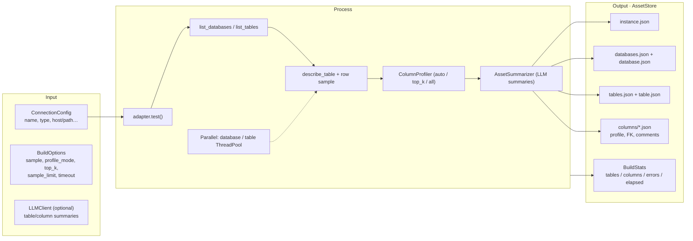
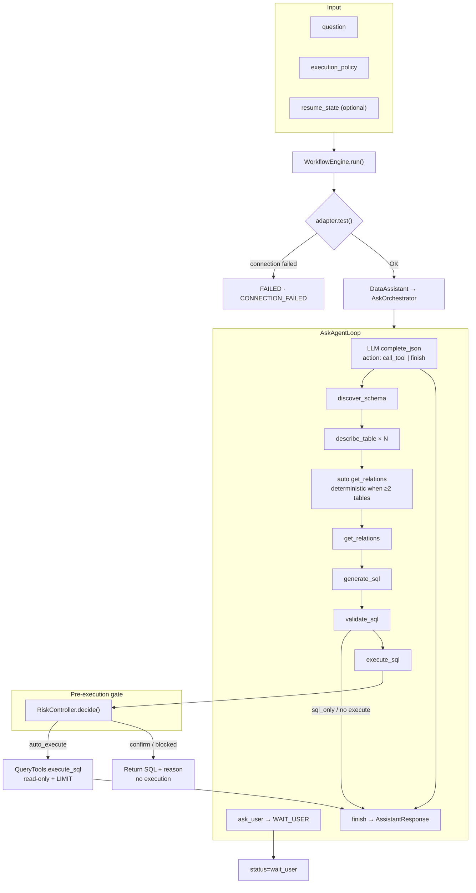
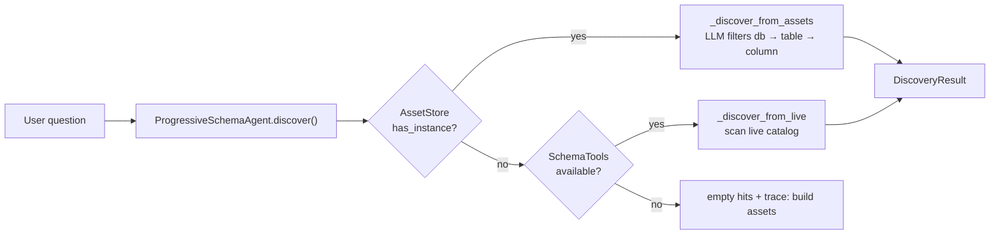
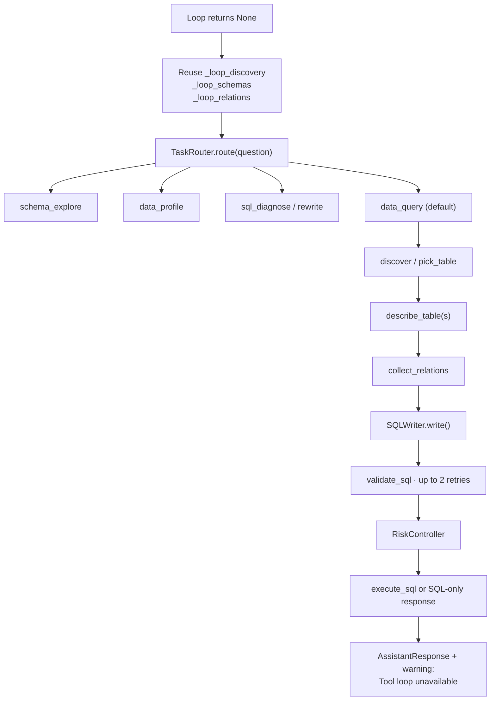
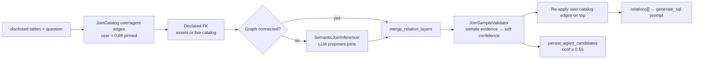
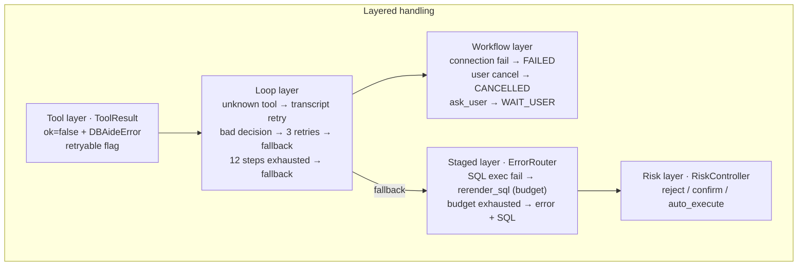
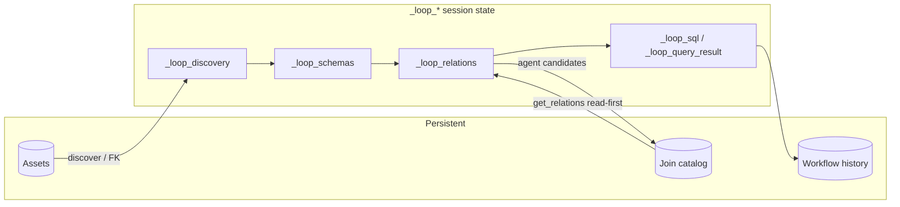

# DBAide Architecture Design

## Positioning

DBAide is a database assistant (CLI + desktop GUI). It is not a pure SQL generator. The system can inspect schema, profile data, generate safe read-only SQL, execute queries, diagnose SQL, and explain results.

Core philosophy (Codex-style):

- **LLM decides** what to do next and how to write SQL.
- **Tools provide evidence** (schema, joins, validation, samples)—not hard business rules disguised as heuristics.
- **Code enforces safety** (validation, execution policy, risk gate, budgets).
- **Progressive disclosure**—never dump the whole database into the prompt at once.

Offline assets accelerate discovery; live adapters remain the fallback when assets are missing or stale.

---

## End-to-End Overview

```mermaid
flowchart TB
    subgraph Entry["Entry layer"]
        GUI["GUI / CLI / DesktopService"]
        WF["WorkflowEngine"]
    end

    subgraph Offline["Offline preparation (recommended)"]
        BA["AssetBuilder.build()"]
        AS[("AssetStore<br/>~/.dbaide/assets/instances/{conn}/")]
        JC[("JoinCatalogStore<br/>~/.dbaide/joins/instances/{conn}/")]
    end

    subgraph Online["Online Ask path"]
        DA["DataAssistant.ask()"]
        ORCH["AskOrchestrator.run()"]
        LOOP["AskAgentLoop<br/>primary · 12-step budget"]
        STAGED["Staged pipeline<br/>fallback"]
    end

    subgraph Output["Output"]
        WR["WorkflowResult"]
        AR["AssistantResponse<br/>answer / sql / result / warnings"]
    end

    GUI -->|build_assets| BA
    GUI -->|ask| WF
    WF --> DA
    DA --> ORCH
    ORCH --> LOOP
    LOOP -->|fail / budget exhausted| STAGED
    LOOP --> AR
    STAGED --> AR
    AR --> WR

    BA --> AS
    ORCH --> AS
    ORCH --> JC
    LOOP --> AS
    LOOP --> JC
```



---

## Progressive Disclosure Layers

```text
L0  instance / connection
L1  database / schema
L2  table list + table metadata
L3  columns under a table
L4  column profiles and samples (offline assets)
L5  join relations, EXPLAIN, execution evidence, result interpretation
```

`DisclosureContext` (session) records what has been disclosed at runtime. Tools update context after schema/profile/query calls. The assistant only receives context earned through tool calls or loaded assets.

Multiple connections are separate instances. Cross-instance joins are intentionally not attempted.

---

## Phase 1: Build Assets

### Flow



### Triggers

| Entry | Action |
|-------|--------|
| GUI TopBar → Build Assets | `DesktopService.build_assets` — multi-DB connections show a picker; partial builds merge with existing assets |
| CLI | `dbaide assets build --database <name>` (repeatable) |
| `connect add` (default) | builds assets on save |

### Asset tree

```text
~/.dbaide/assets/instances/<instance>/
  instance.json
  databases.json
  databases/<database>/
    database.json
    tables.json
    tables/<table>/
      table.json
      columns/<column>.json
```

### Build exception handling

| Scenario | Strategy | User-visible |
|----------|----------|--------------|
| Single DB/table failure | Log to `BuildStats.errors[]`, continue others | Partial ready |
| Time budget (`deadline`) | Skip remaining DBs/tables, record skip | Warning list |
| No LLM | Summaries degrade to rule-based text | Build still completes |
| Connection test fails | Abort instance build | Error message |

---

## Phase 2: Ask — Primary Path (Tool Loop)

### Request / response

**Input (`WorkflowRequest`):**

| Field | Meaning |
|-------|---------|
| `question` | Natural language question |
| `database_scope` | Optional database filter |
| `execution_policy` | `safe_auto` / `sql_only` / `inspect_only` / `expert` |
| `resume_state` + `user_reply` | Resume after `ask_user` clarification |

**Output (`WorkflowResult` / `AssistantResponse`):**

| Field | Meaning |
|-------|---------|
| `answer` | Markdown answer |
| `sql` | Generated SQL (if any) |
| `result` | Query rows (if executed) |
| `warnings` | Policy blocks, fallback notices, risk confirms |
| `status` | `completed` / `wait_user` / `failed` / `cancelled` |
| `resume_state` | Serialized loop state when waiting for user |

### Loop flow



### Tool I/O (query path)

| Tool | Input | Output |
|------|-------|--------|
| `discover_schema` | `question` | `hits[]`, `trace` |
| `describe_table` | `table`, `database?` | `columns[]` → `_loop_schemas` |
| `get_relations` | disclosed tables | `relations[]` + confidence; may persist agent candidates |
| `generate_sql` | question + schemas + relations | `sql`, `rationale`, `confidence` |
| `validate_sql` | `sql` | `ok`, `normalized_sql`, `issues`, `risk_level` |
| `execute_sql` | `sql` | `rows`, `row_count` or `blocked` |
| `ask_user` | `question`, `options?` | `pending: true` → workflow pause |

Join catalog CRUD (`list/add/update/delete_join`) is available via GUI/Service but **not exposed to the loop LLM** during normal queries.

### Schema discovery source



---

## Phase 3: Staged Fallback

When the tool loop returns `None` (invalid decision, step budget exhausted, exception), the orchestrator runs a staged pipeline that **reuses warm loop state** when available.



Both paths share: `collect_relations`, `SQLWriter`, `validate_sql`, `RiskController`, `ResultInterpreter`.

---

## Join Relation Pipeline

Used inside `get_relations` (and optionally on `generate_sql` when relations cache is empty for multi-table queries).



Principles:

- **LLM proposes** semantic joins when FK + catalog do not connect all tables.
- **No column-name keyword heuristics** (e.g. no `*_id` matching rules).
- Sample validation **adjusts confidence only**; it does not hard-block unusual business joins.
- Semantic edges with confidence &lt; 0.18 are dropped; user/FK edges are not.
- Join catalog CRUD is a **fact layer** for users; the agent reads it via `get_relations`.

### Join confidence → risk gate

When SQL contains `JOIN`, `join_confidence_for_sql()` takes the **minimum confidence** among relations whose tables appear in the SQL. `RiskController` uses this as a soft signal:

| `join_confidence` | Effect |
|-------------------|--------|
| ≥ 0.8 | May `auto_execute` (if other checks pass) |
| &lt; 0.8 | `confirm` — return SQL without auto execution |

User catalog joins (0.99) and strong FK edges typically pass; low-confidence semantic edges trigger confirmation.

---

## Exception Handling



| Scenario | Strategy | User-visible |
|----------|----------|--------------|
| No LLM configured | Loop skipped; prompt to configure Models | Settings guidance |
| No offline assets | `discover_schema` uses live catalog | Trace suggests build assets |
| `validate_sql` unknown table/column | Feedback → `describe_table` → retry `generate_sql` | Self-heal in loop transcript |
| Execute blocked by policy | `blocked: true` + SQL | SQL shown + reason |
| Low join confidence | `confirm`, no auto execute | SQL shown; manual confirm |
| Loop failure overall | Staged pipeline + warning | Answer/SQL still possible |
| Partial asset build | Errors in `BuildStats.errors` | Partial ready state |
| SQL execution error | `ErrorRouter` → one self-correction attempt | Error + optional corrected SQL |

### ErrorRouter repair budget

- Max **2 repairs per stage**, **5 total** per workflow.
- Maps error codes to actions: `REFRESH_SCHEMA`, `RERENDER_SQL`, `REPLAN`, `ASK_USER`, `STOP`, etc.
- Used primarily in staged execution path after SQL failures.

---

## Runtime State & Persistence



---

## Module Boundaries

```text
CLI / GUI
  command dispatch, progress UI

WorkflowEngine
  connection check, trace, WorkflowResult assembly

DataAssistant / AskOrchestrator
  routes to loop or staged pipeline

AskAgentLoop
  LLM tool-calling loop, auto get_relations, ask_user pause/resume

Tools (toolkit)
  discover, describe, relations, SQL gen/validate/execute, profile

Agent helpers
  ProgressiveSchemaAgent, SemanticJoinInferencer, SQLWriter, JoinSampleValidator

Controllers
  RiskController (execute gate), ResultInterpreter, ErrorRouter

Assets
  AssetBuilder, AssetStore, AssetSummarizer, ColumnProfiler

Joins
  JoinCatalogStore (user + agent-saved edges)

Validation
  deterministic SQL guards (single statement, read-only, LIMIT, EXPLAIN)

Adapters
  database-specific metadata, EXPLAIN, read-only execute
```

Adapters are the only layer that knows driver details.

---

## Safety Defaults

- Single SQL statement only.
- Only `SELECT`, `WITH`, and `EXPLAIN` allowed.
- DDL/DML keywords blocked.
- Dangerous functions and file access patterns blocked.
- Default `LIMIT` unless query is explicitly bounded.
- `EXPLAIN` preflight where supported.
- Read-only execution mode where the driver supports it.
- Result explanation based on **actual returned rows**, not fabrication.

### Execution policies

| Policy | Behavior |
|--------|----------|
| `safe_auto` | Validate + risk gate; auto execute when low risk |
| `expert` | Relaxed auto execute |
| `sql_only` | Generate and validate; never execute |
| `inspect_only` | Schema/profile answers; reject execution |

---

## Design Principles (anti-complexity)

1. **Two execution paths, one core** — Loop decides steps; staged fallback reuses the same SQL/join/risk stack.
2. **Assets are an accelerator, not a hard dependency** — Live discovery works when assets are missing.
3. **Join catalog is a fact layer** — User pins at 0.99; agent reads, does not CRUD during queries.
4. **Risk gate only at execute** — Validation checks syntax/safety; `RiskController` checks whether to run.
5. **Soft signals, hard safety** — Join confidence and sample match rates inform ranking and confirm; they do not replace LLM judgment for SQL.
6. **Deterministic helpers in code** — Auto `get_relations`, persist join candidates, validation, budgets—not extra LLM agents.

---

## Extensibility

**Add a database adapter**

1. Implement `DatabaseAdapter`.
2. Register in `adapters/__init__.py`.
3. Add adapter tests with a disposable database.

**Add an agent tool**

1. Define spec in `tools/specs.py`.
2. Register handler in `agent/toolkit.py`.
3. Add to `LOOP_DECISION_TOOL_NAMES` if the loop LLM should see it.
4. Add tests via `build_tool_registry`.

**Add a model provider**

1. Implement `LLMClient`.
2. Register in `build_llm_client`.
3. Validate JSON outputs at caller boundaries.

---

## Related Docs

- [README.md](../README.md) — quick start and CLI usage
- Join catalog path: `~/.dbaide/joins/instances/{instance}/joins.json`
- Asset path: `~/.dbaide/assets/instances/{instance}/`
