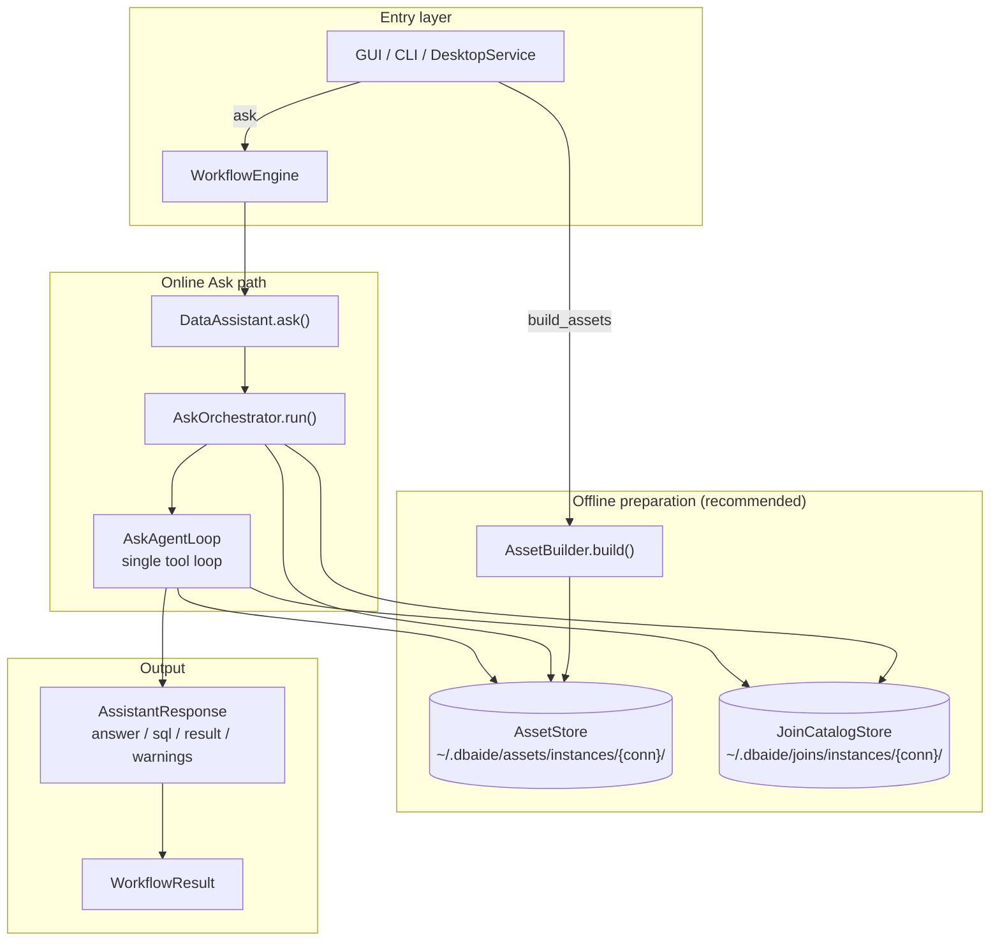
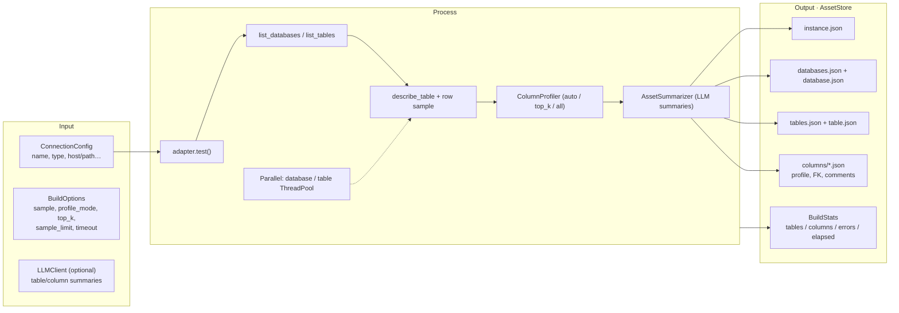
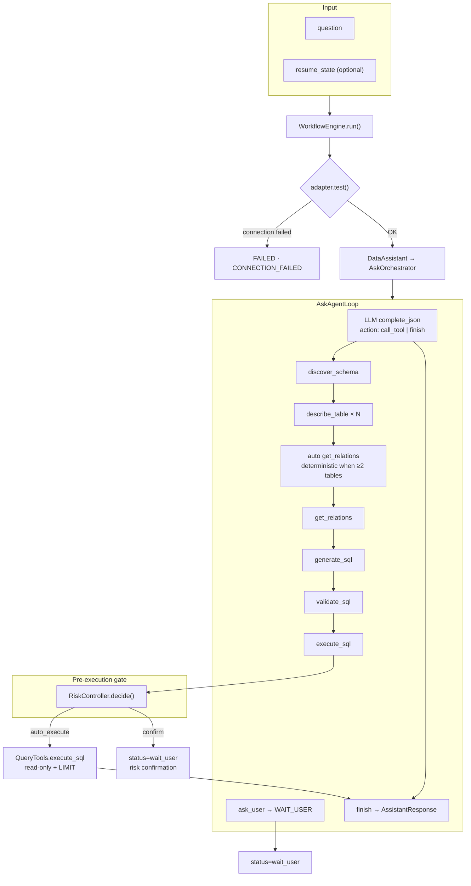
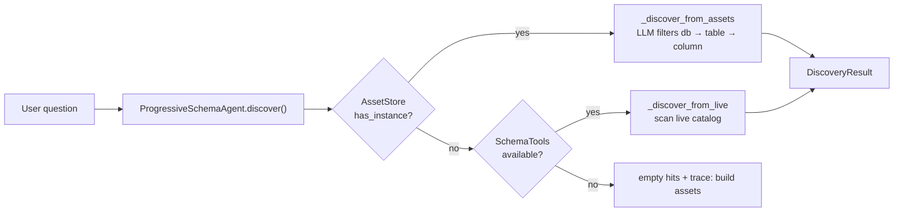
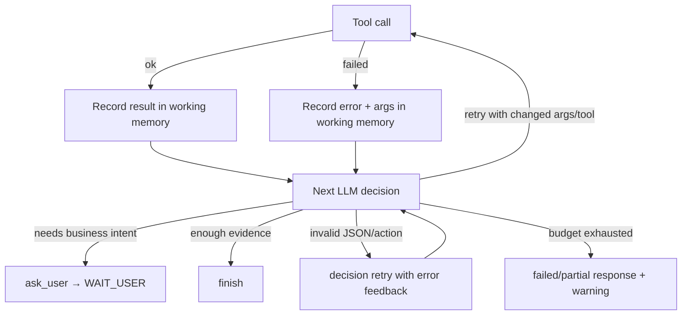
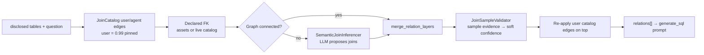
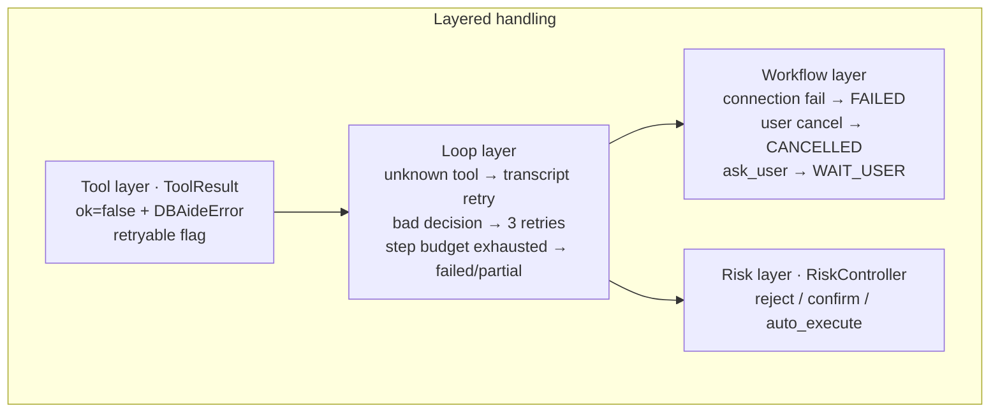
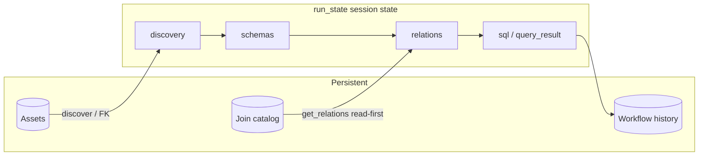

# DBAide Architecture Design

## Positioning

DBAide is a database assistant (CLI + desktop GUI). It is not a pure SQL generator. The system can inspect schema, profile data, generate safe read-only SQL, execute queries, diagnose SQL, and explain results.

Core philosophy (Codex-style):

- **LLM decides** what to do next and how to write SQL.
- **Tools provide evidence** (schema, joins, validation, samples)—not hard business rules disguised as heuristics.
- **Code enforces safety** (validation, read-only execution, risk gate, budgets).
- **Progressive disclosure**—never dump the whole database into the prompt at once.

Offline assets accelerate discovery; live adapters remain the fallback when assets are missing or stale.

---

## End-to-End Overview



---

## Progressive Disclosure Layers

```text
L0  instance / connection
L1  database / schema
L2  table list + table metadata
L3  columns under a table
L4  column profiles and samples (offline assets)
L5  join relations, EXPLAIN, execution evidence, result interpretation
```

`DisclosureContext` (session) records what has been disclosed at runtime. Tools update context after schema/profile/query calls. The assistant only receives context earned through tool calls or loaded assets.

Multiple connections are separate instances. Cross-instance joins are intentionally not attempted.

---

## Phase 1: Build Assets

### Flow



### Triggers

| Entry | Action |
|-------|--------|
| GUI TopBar → Build Assets | `DesktopService.build_assets` — multi-DB connections show a picker; partial builds merge with existing assets |
| CLI | `dbaide assets build --database <name>` (repeatable) |
| `connect add` (default) | builds assets on save |

### Asset tree

```text
~/.dbaide/assets/instances/<instance>/
  instance.json
  databases.json
  databases/<database>/
    database.json
    tables.json
    tables/<table>/
      table.json
      columns/<column>.json
```

### Build exception handling

| Scenario | Strategy | User-visible |
|----------|----------|--------------|
| Single DB/table failure | Log to `BuildStats.errors[]`, continue others | Partial ready |
| Time budget (`deadline`) | Skip remaining DBs/tables, record skip | Warning list |
| No LLM | Summaries degrade to rule-based text | Build still completes |
| Connection test fails | Abort instance build | Error message |

---

## Phase 2: Ask — Primary Path (Tool Loop)

### Request / response

**Input (`WorkflowRequest`):**

| Field | Meaning |
|-------|---------|
| `question` | Natural language question |
| `database_scope` | Optional database filter |
| `resume_state` + `user_reply` | Resume after `ask_user` clarification |

**Output (`WorkflowResult` / `AssistantResponse`):**

| Field | Meaning |
|-------|---------|
| `answer` | Markdown answer |
| `sql` | Generated SQL (if any) |
| `result` | Query rows (if executed) |
| `warnings` | Loop failure notices, risk confirmations, execution warnings |
| `status` | `completed` / `wait_user` / `failed` / `cancelled` |
| `resume_state` | Serialized loop state when waiting for user |

### Loop flow



### Tool I/O (query path)

| Tool | Input | Output |
|------|-------|--------|
| `discover_schema` | `question` | `hits[]`, `trace` |
| `describe_table` | `table`, `database?` | `columns[]` → `run_state.schemas` |
| `get_relations` | disclosed tables | `relations[]` + confidence |
| `generate_sql` | question + schemas + relations | `sql`, `rationale`, `confidence` |
| `validate_sql` | `sql` | `ok`, `normalized_sql`, `issues`, `risk_level` |
| `execute_sql` | `sql` | `rows`, `row_count` or `blocked` |
| `ask_user` | `question`, `options?` | `pending: true` → workflow pause |

Join catalog CRUD (`list/add/update/delete_join`) is available via GUI/Service but **not exposed to the loop LLM** during normal queries.

### Batched read-only evidence (`action: call_tools`)

To cut round-trips, one decision may carry several **independent, read-only** tool
calls (`action: "call_tools"`, `calls: [{tool, args}, …]`). The loop runs them **in
order** through the same per-tool path (each records into memory, traces, and charges
a step), then makes one combined next decision. Only `BATCHABLE_TOOLS` qualify —
`describe_table`, `column_stats`, `profile_table`, `retrieve_schema_context`,
`inspect_metadata`, `retrieve_join_context`, `list_tables/databases`,
`retrieve_memory_item`. Anything with a safety gate or ordering dependency — the
`generate_sql → validate_sql → execute_sql` chain, `ask_user`, and writes — is
**dropped from the batch** (surfaced to the model to re-issue singly), so each keeps
its risk gate, validation order, and pause/resume. Batching is sequential, not
parallel, so the `QueryBudget` in-flight cap is unchanged.

### Schema discovery source



---

## Phase 3: Loop Failure Handling

There is one Ask execution path: the LLM tool loop. Tool failures are recorded
into working memory as observations, and the next LLM decision chooses whether to
retry with different evidence, inspect another path, ask the user, or finish from
the available evidence. Invalid LLM decisions are retried in-place with a repair
message; after repeated invalid decisions or a total step-budget exhaustion, the
workflow returns an honest failed or partial response instead of degrading into a
second pipeline.



---

## Join Relation Pipeline

Used inside `get_relations` (and optionally on `generate_sql` when relations cache is empty for multi-table queries).



Principles:

- **LLM proposes** semantic joins when FK + catalog do not connect all tables.
- **No column-name keyword heuristics** (e.g. no `*_id` matching rules).
- Sample validation **adjusts confidence only**; it does not hard-block unusual business joins.
- Semantic edges with confidence &lt; 0.18 are dropped; user/FK edges are not.
- Join catalog CRUD is a **fact layer** for users; the agent reads it via `get_relations`.

### Join confidence → risk gate

When SQL contains `JOIN`, `join_confidence_for_sql()` takes the **minimum confidence** among relations whose tables appear in the SQL. `RiskController` uses this as a soft signal:

| `join_confidence` | Effect |
|-------------------|--------|
| ≥ 0.8 | May `auto_execute` (if other checks pass) |
| &lt; 0.8 | `confirm` — return SQL without auto execution |

User catalog joins (0.99) and strong FK edges typically pass; low-confidence semantic edges trigger confirmation.

---

## Exception Handling



| Scenario | Strategy | User-visible |
|----------|----------|--------------|
| No LLM configured | Loop skipped; prompt to configure Models | Settings guidance |
| No offline assets | `discover_schema` uses live catalog | Trace suggests build assets |
| `validate_sql` invalid schema references | Feedback → inspect relevant objects → retry corrected SQL | Self-heal in loop transcript |
| Risky read-only SQL | Risk confirmation pause with exact SQL + reason | User approves or cancels |
| Low join confidence | `confirm`, no auto execute | SQL shown; manual confirm |
| Loop failure overall | Honest failed/partial response + warning | No silent alternate pipeline |
| Partial asset build | Errors in `BuildStats.errors` | Partial ready state |
| SQL execution error | Error recorded in memory; LLM decides next action | Retry with changed SQL/tool or explain failure |

---

## Runtime State & Persistence



---

## Module Boundaries

```text
CLI / GUI
  command dispatch, progress UI

WorkflowEngine
  connection check, trace, WorkflowResult assembly

DataAssistant / AskOrchestrator
  routes to the single Ask tool loop

AskAgentLoop
  LLM tool-calling loop, auto get_relations, ask_user pause/resume

Tools (toolkit)
  discover, describe, relations, SQL gen/validate/execute, profile

Agent helpers
  ProgressiveSchemaAgent, SemanticJoinInferencer, SQLWriter, JoinSampleValidator

Controllers
  RiskController (execute gate), ResultInterpreter

Assets
  AssetBuilder, AssetStore, AssetSummarizer, ColumnProfiler

Joins
  JoinCatalogStore (user + agent-saved edges)

Validation
  deterministic SQL guards (single statement, read-only, LIMIT, EXPLAIN)

Adapters
  database-specific metadata, EXPLAIN, read-only execute
```

Adapters are the only layer that knows driver details.

---

## Safety Defaults

- Single SQL statement only.
- Only `SELECT`, `WITH`, and `EXPLAIN` allowed.
- DDL/DML keywords blocked.
- Dangerous functions and file access patterns blocked.
- Default `LIMIT` unless query is explicitly bounded.
- `EXPLAIN` preflight where supported.
- Read-only execution mode where the driver supports it.
- Result explanation based on **actual returned rows**, not fabrication.

### Execution mode

DBAide exposes one mode: guarded read-only execution. The agent may generate,
validate, diagnose, and run read-only SQL. SQL that passes validation and risk
checks executes automatically; risky-but-read-only SQL pauses and asks the user
for confirmation with the exact SQL and reason.

---

## Resource & Safety (DB load control)

DBAide is an *assistant*: its load on a production database must be negligible.
Every SQL statement — build, agent, or GUI — flows through one resource layer.

```
AssetBuilder / Agent / GUI        ← caller tag (build|agent|gui|cli)
        ↓ (single entry)
DatabaseAdapter.execute_readonly  ← acquire budget → apply timeout → run → audit
        ↓
QueryBudget(instance)             ← BoundedSemaphore; caps in-flight queries (= connections)
        ↓
ResourcePolicy(connection)        ← load_profile preset + [resource_defaults] overrides
        ↓
QueryLog(instance)                ← every SQL → ~/.dbaide/logs/queries/{instance}.jsonl
```

### Load profiles (`dbaide/db/policy.py`)

A connection's `load_profile` selects a preset; values are overridable per-key via
`[resource_defaults]` in `~/.dbaide/config.toml` or the GUI **Settings → Resources** page.
New connections default to **production**.

| Knob | production | staging | dev |
|------|-----------:|--------:|----:|
| `max_inflight_queries` | 2 | 4 | 8 |
| `statement_timeout_seconds` | 8 | 10 | 30 |
| `build_max_workers` | 1 | 2 | 4 |
| `build_profile_mode` | light | auto | auto |
| `default_row_limit` | 100 | 100 | 200 |
| `max_row_limit` (hard) | 1000 | 5000 | 50000 |
| `big_table_rows` | 1e6 | 5e6 | 5e7 |
| `explain_max_rows` | 5e6 | 2e7 | 2e8 |

### Invariants

- **Concurrency is bounded** — one `QueryBudget` semaphore per instance, shared by
  build/agent/gui. No nested thread pools; the asset builder uses a single pool sized
  by `build_max_workers`.
- **Queries are predictable** — every statement has a timeout and a row limit; no
  `ORDER BY RAND()`; column profiling merges count/null/distinct/min/max/avg/length
  into one scan; tables above `big_table_rows` drop to metadata-only (`light`) profiling.
- **Execution is audited** — `QueryLog` records caller, SQL, elapsed, rows, and status
  for every query. Inspect with `dbaide queries <conn> --tail N`, the GUI trace
  (agent SQL), or the jsonl file directly.
- **Agent hard gates**: `LIMIT` above `max_row_limit` requires confirmation;
  unfiltered `SELECT *` is force-limited; `EXPLAIN` row estimate above
  `explain_max_rows` requires confirmation; low-confidence joins require
  confirmation.

### Recommended production workflow

```bash
# Lowest-load build (metadata + key columns only):
dbaide assets build prod --load-profile production --profile-mode light
# Estimate cost before touching the DB:
dbaide assets build prod --dry-run
# Inspect exactly what ran:
dbaide queries prod --tail 50
```

---

## Design Principles (anti-complexity)

1. **One execution path** — The Ask loop decides steps; failures become memory, not a hidden fallback pipeline.
2. **Assets are an accelerator, not a hard dependency** — Live discovery works when assets are missing.
3. **Join catalog is a fact layer** — User pins at 0.99; agent reads, does not CRUD during queries.
4. **Risk gate only at execute** — Validation checks syntax/safety; `RiskController` checks whether to run.
5. **Soft signals, hard safety** — Join confidence and sample match rates inform ranking and confirm; they do not replace LLM judgment for SQL.
6. **Deterministic helpers in code** — Auto `get_relations`, validation, budgets—not extra LLM agents.

---

## Extensibility

**Add a database adapter**

1. Implement `DatabaseAdapter`.
2. Register in `adapters/__init__.py`.
3. Add adapter tests with a disposable database.

**Add an agent tool**

1. Define spec in `tools/specs.py`.
2. Register the handler in the relevant `agent/toolkit/*_tools.py` module.
3. Add to `LOOP_DECISION_TOOL_NAMES` in `agent/toolkit/__init__.py` if the loop LLM should see it.
4. Add tests via `build_tool_registry`.

**Add a model provider**

1. Implement `LLMClient`.
2. Register in `build_llm_client`.
3. Validate JSON outputs at caller boundaries.

---

## Related Docs

- [README.md](../README.md) — quick start and CLI usage
- Join catalog path: `~/.dbaide/joins/instances/{instance}/joins.json`
- Asset path: `~/.dbaide/assets/instances/{instance}/`
