# DBAide 截图导览

这份文档是 [README.zh-CN.md](../README.zh-CN.md) 和 [DESIGN.md](DESIGN.md)
的可视化补充。下方图片均来自当前代码：应用截图通过
[`tools/shoot_docs.py`](../tools/shoot_docs.py) /
[`tools/shoot_promo.py`](../tools/shoot_promo.py) 生成；其中图表回答截图强制走
真实 Qt WebEngine 渲染，未成功渲染时会直接失败，不再静默降级。

## 1. 业务分析流程

### 离线资产与渐进式发现

DBAide 不会把整库 schema 一次性塞进 prompt，而是先构建或读取离线资产，
再按 连接 → 数据库 → 表 → 列 逐步收窄。

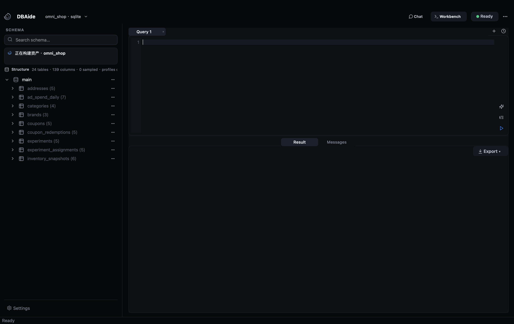

### 自然语言分析流程

面对跨业务域问题，Agent 会先选择表、确认 join、规划分析路径，并在准备证据时
保持运行态可见。

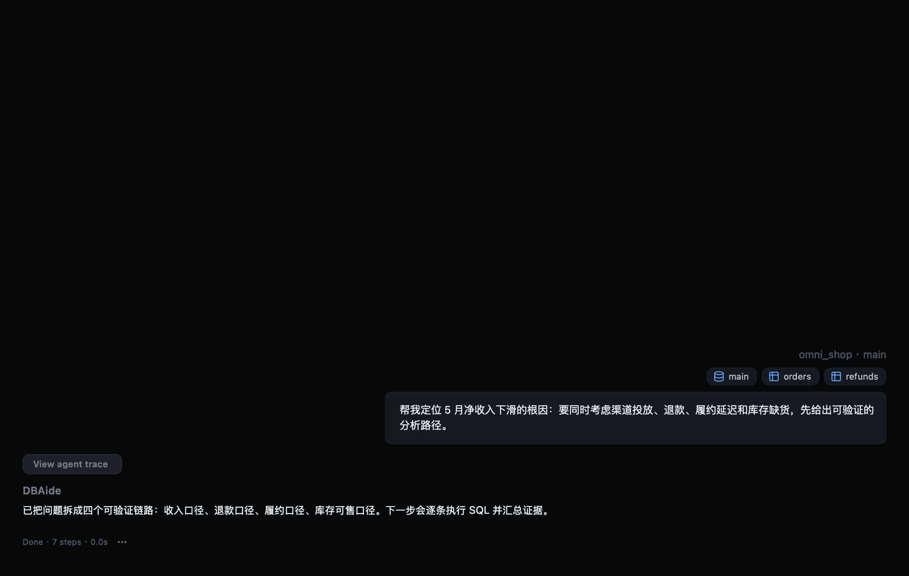

### 对话内原生图表渲染

图表由独立 chart agent 输出结构化 spec，再由本地 ECharts renderer 渲染到
同一个 Qt WebEngine 回答文档里，而不是让模型直接写前端 option 代码。

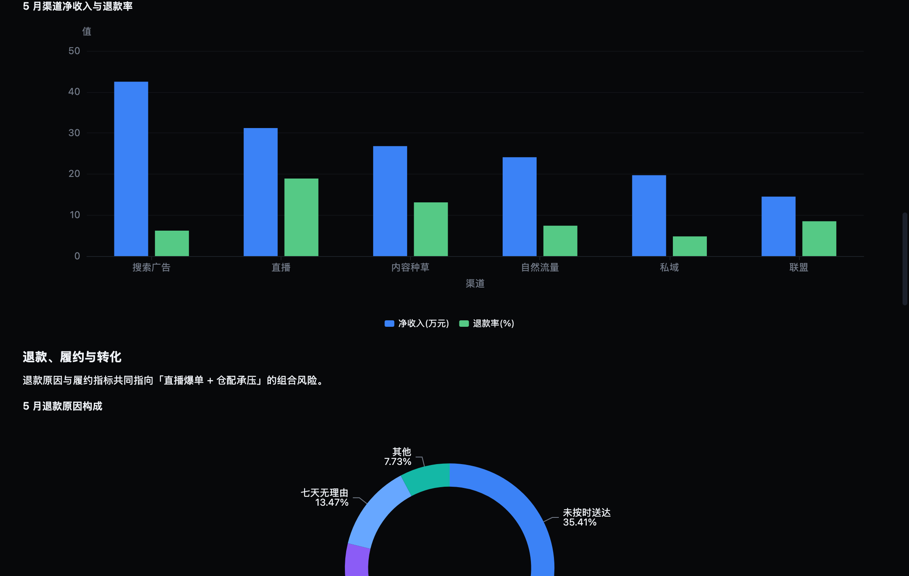

### 遇到歧义先澄清

当指标口径、归属时间、异常阈值等存在业务歧义时，DBAide 会暂停并主动追问，
而不是默认脑补。

### 运行态可见

它不是一次性黑盒。对话流里可以直接看到当前 turn、回答结果，以及 trace 入口。

### Trace 时间线侧栏

完整 trace 会在右侧抽屉中展开，时间线、耗时和步骤详情都保留下来，不会把原始事件
JSON 直接塞回主对话区。

## 2. 开发排障流程

### 字段不存在时先探索真实结构

开发者输入一个不存在的字段名时，DBAide 不会硬编 SQL，而是先搜字段、读表结构、
验证关联路径，再把查询改写到真实列上。

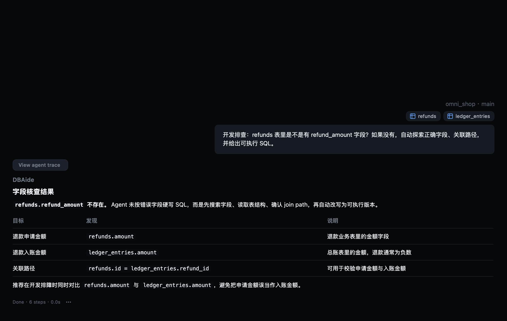

### 跨表一致性校验

它也可以作为开发排障助手：先统一粒度，再对 orders、payments、refunds、
ledger_entries 做差异比较，并继续对异常分桶归因。

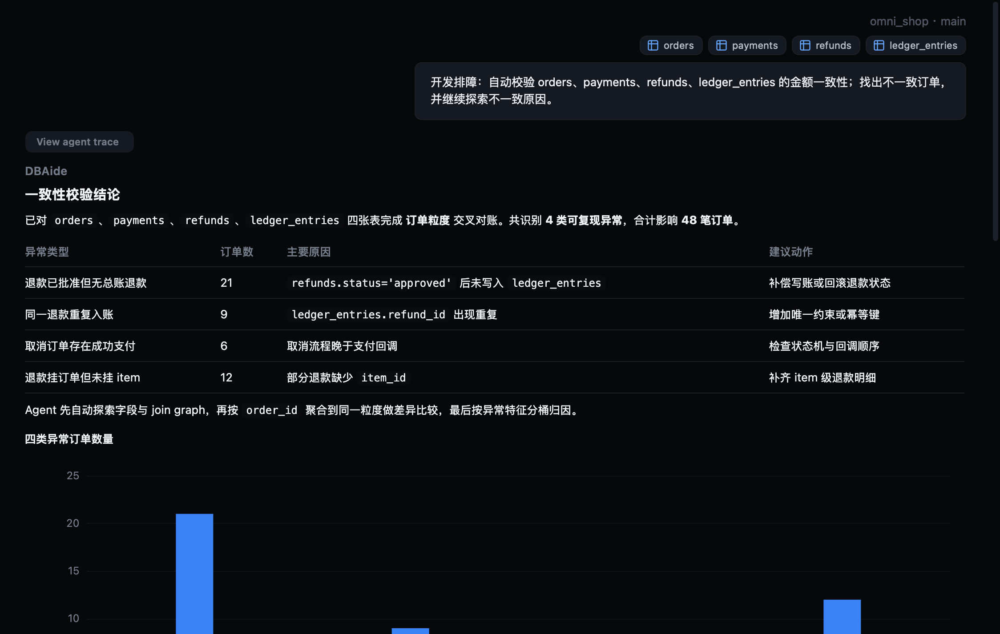

### 完整 SQL 工作台

桌面端内置多文档工作台，提供 SQL 编辑、结构查看、数据浏览、导出、历史与复核能力。

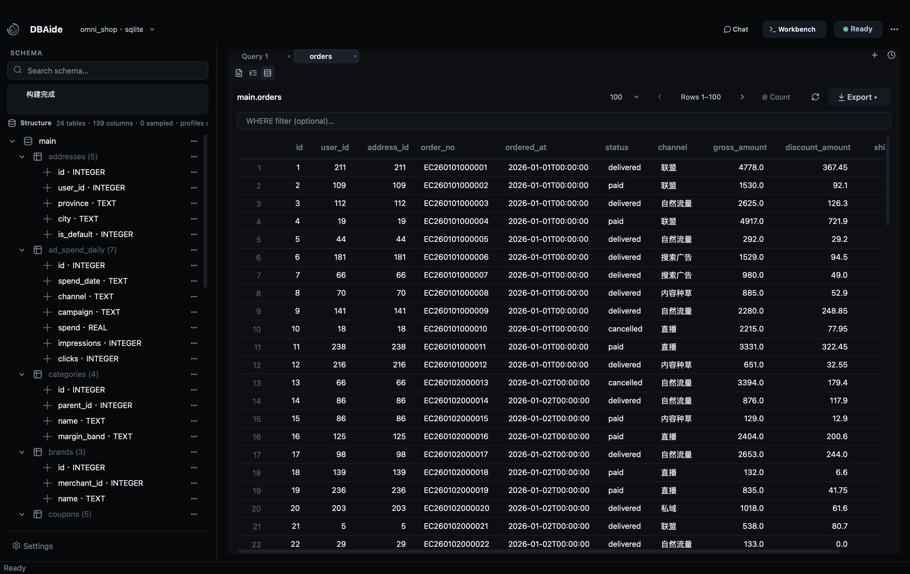

## 3. 配置、安全与运维

### 连接管理

连接配置集中管理，并与 CLI 共用同一份配置。导入/导出也从这里进入，便于环境迁移。

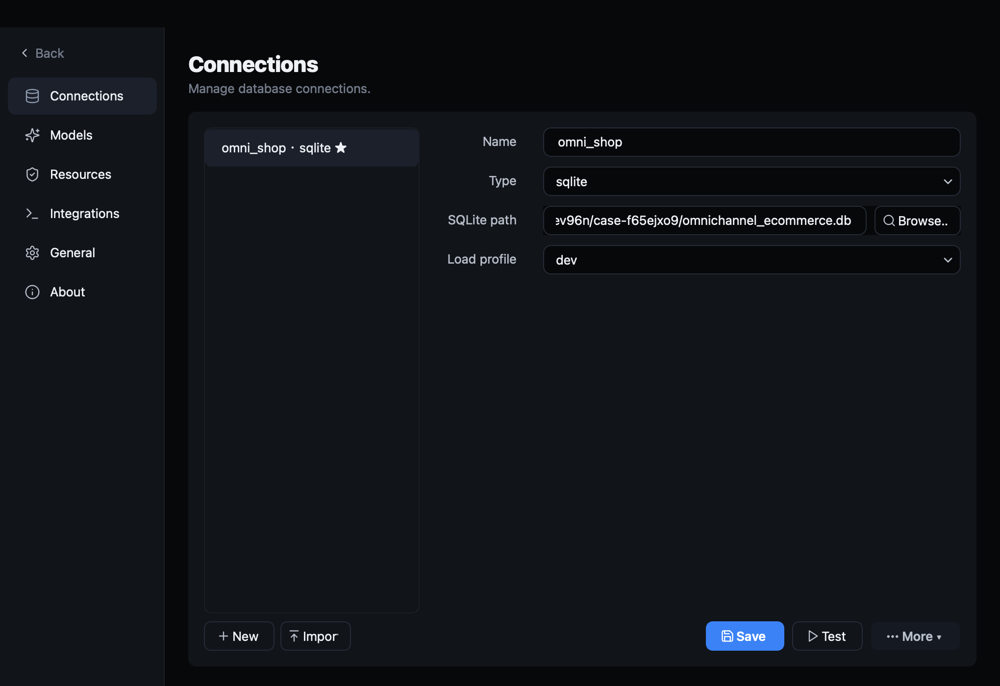

### 模型配置

Provider、Base URL、Model ID、超时、API Key、上下文长度全部显式配置，而不是隐藏在代码里。

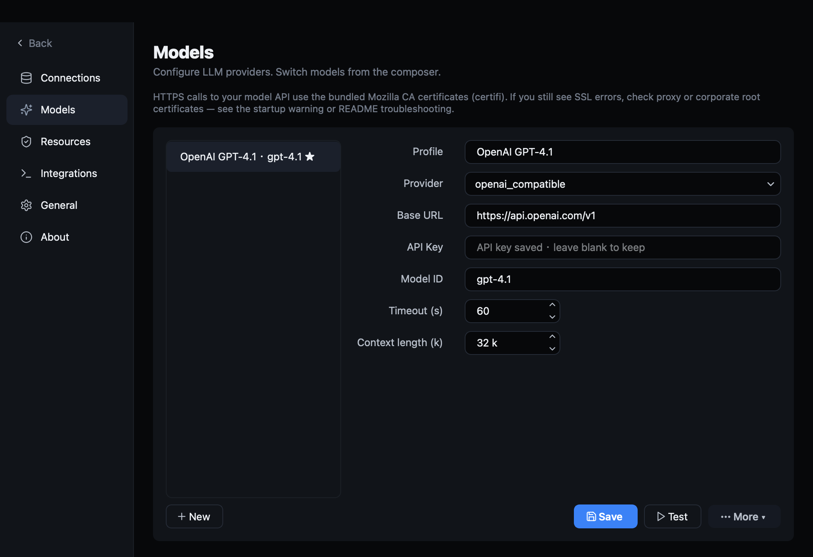

### 资源限制与安全护栏

这一页集中暴露了对真实数据库最关键的安全阈值：

- 最大并发运行数
- 最大并发查询数
- 单语句超时
- 默认 / 最大返回行数
- 大 LIMIT 确认阈值
- 大表阈值
- EXPLAIN 成本闸
- join sample 大小
- agent 步数预算
- prior-turn 记忆窗口
- 最新结果截断上限
- 压缩阈值

### MCP / 编码工具集成

DBAide 可以注册为 Claude、Codex、Cursor、Roo、Gemini、Qwen、Windsurf、
Opencode 的 MCP server，并支持三种模式：

- `full`：高层 ask + 原子工具
- `ask`：仅高层 ask
- `tools`：仅原子数据库工具

### 备份管理器

备份是一级功能：可以生成表/库导出，并统一查看历史备份的大小、行数、格式和时间。

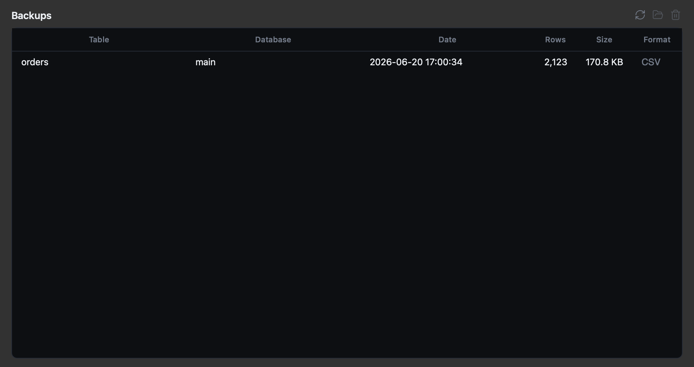

### 局部构建资产

资产构建不是只能“全量重扫”，可以选择数据库，并设置并发和总时间预算。

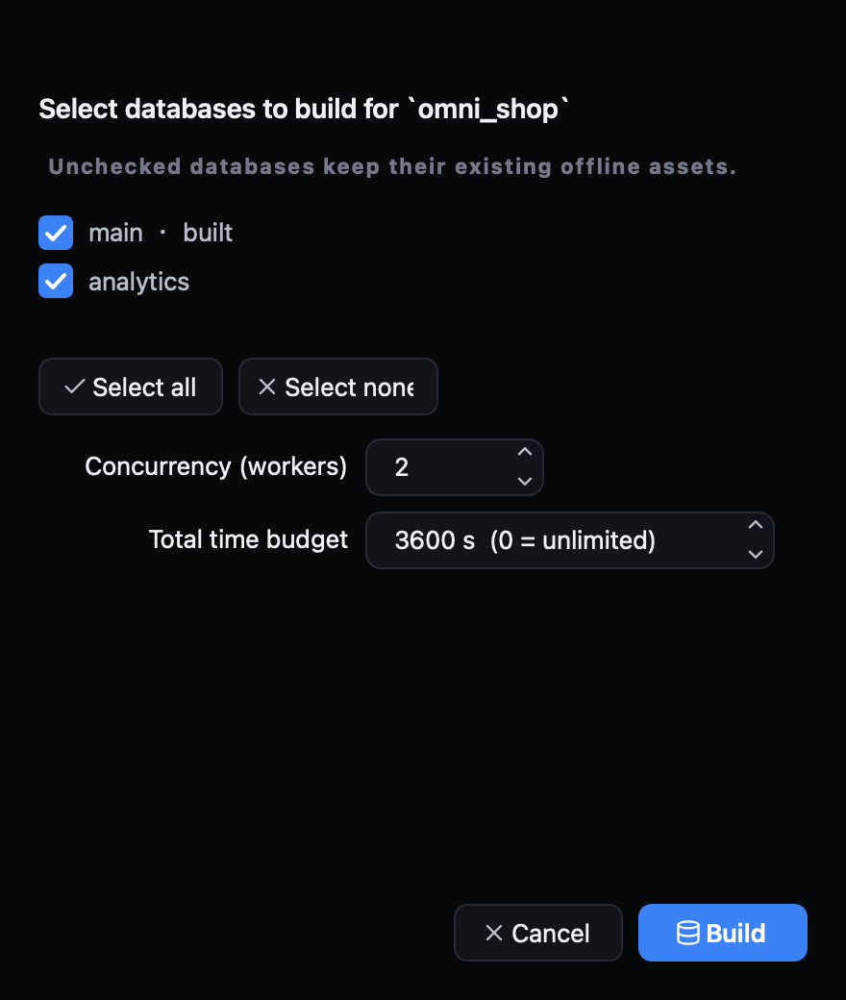

### 安全接入数据库

连接表单包含 load profile、会话时区和 SSL 模式，默认更适合以保守方式接入生产环境。

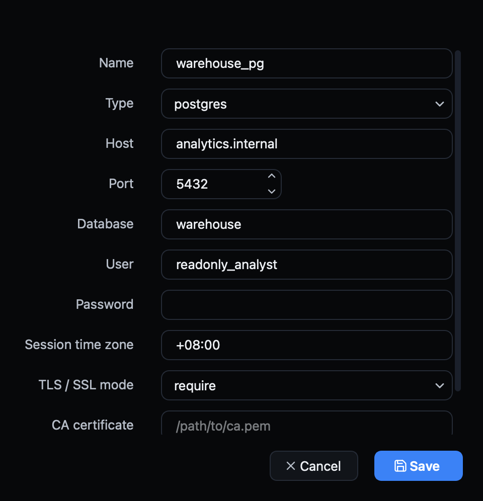

## 4. 这些截图背后的设计含义

这些界面背后对应的是几条明确的系统原则：

- **本地优先**：桌面端 / CLI 直接连接数据库
- **默认只读**：Agent 只会走校验后的 `SELECT`
- **渐进式披露**：上下文靠工具调用逐步获得
- **结构化图表规划**：模型决定图表意图，不直接拼前端代码
- **执行透明**：trace、SQL、限制、导出全部可见
- **一套核心，两种界面**：CLI 与桌面端共享配置、安全策略与工具层

如果你想看更偏产品叙事的中文宣传文章，见
[BLOG.zh-CN.md](BLOG.zh-CN.md)。
